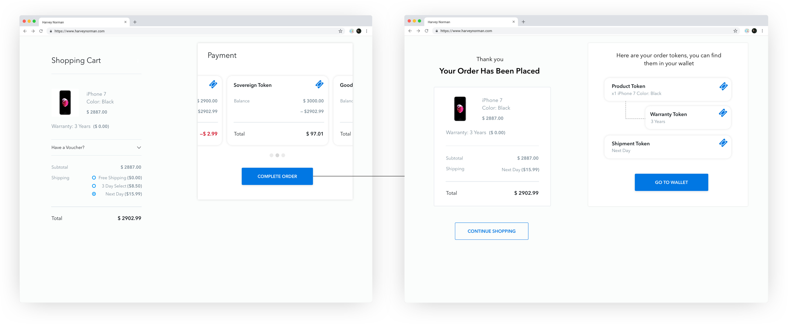
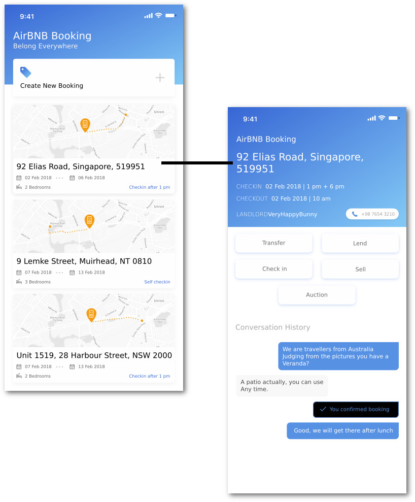

# TBML Design Paper

## Author's note

The remarkable blockchain speculations that took place in 2017 - 2018 brought everyone's attention to crypto tokens. As we bought and sold them, we forgot their intended purpose was to be used; this is analogous to the housing bubble in which people forgot that houses were not merely speculative assets but rather a place to live.

To provide a practical use of the blockchain, we must understand its utility to the world economy and the internet. The authors of this paper are technical experts who went through years of study and exploration into its applications both via financial institutions and startups. With this experience, we came to realise that the blockchain has **two primary functions** which we will elaborate further in this paper.

Despite the great folly in 2017-2018, it is not a bad thing to initially focus on tokens. Tokens, as the authors will elaborate, are the enabler of the two primary functions. We define the technique to make it happen in "Tokenisation".

Previous efforts in this industry primarily focused on enriching the capacity of the technology. This paper will focus on tokenisation and introduce a standardisation effort known as TBML (Token Behaviour Markup Language) which will make the blockchain technical stack complete, providing utility for the economy and the internet.

## Join the game

Please join our work at xxx. A Yellow Paper to guide implementors to use TBML for their tokens and dapps will take months to make, but a work in progress is always available online. Participate now to avoid the draft language specification being made without consideration your token model.

\pagebreak

# Introduction: What does blockchain *do*?

Blockchain technology has **two primary functions** that serve essential purposes for the future economy and the future Internet:

- providing a frictionless market; and
- integrating the web.

This paper will address the vision of where we can be and follow up with the design and reasoning behind the architecture needed on top of the blockchain. We will then explain TBML which is a critical missing layer and go over its design principles and how we are building it.

## Blockchain provides a frictionless market

The 80s' "Back to the Future" featured a world of powerful machines filled with hovering boards and flying cars. It didn't happen. As Peter Thiel once famously lamented, "we were promised flying cars; instead, we got 140 characters". The technological advancement of our time is beyond the imagination of the 80s science fiction movies, albeit not through more powerful machinery, but efficient use of the Internet.

Ride-sharing revolutionised the way we organise our daily lives, and AirBNB changed the way we travel. These are the new, less frictional markets. They incur less cost to operate, are more accessible and have finer operational units.

However, despite this web 2.0 revolution, the majority of markets still operate with high costs. The stock market, for example, has so much overhead that it is only justifiable for multi-million dollar businesses which rely on the trust of rules and regulations to operate.

With blockchain, any tokenised asset can be transacted any time, as long as it follows the rules, without middlemen or intermediary, gives us maximum market efficiency - the frictionless market. On top of the benefits of not relying on an intermediary, in a tokenised market model, the buyers and sellers do not need to "enter" the market; instead, tokens are *always on the market*[^market-model], making such a model better than intermediaries.

[^market-model]: With the traditional intermediary-operated market model, a trade is made in two stages: entering the market, making a deal. Blockchain can simplify that into a protocol; therefore the blockchain token assets can be considered always on the market.

### Can we create a frictionless market through tokenisation?

Can we tokenise, for example, 1% of a property, so that the property market can react faster than the typical month-long property purchase-sales cycle?

Can we tokenise electricity, allowing power users to benefit from finer scheduling of the use of resources, and households to benefit from collecting surplus sun energy?

Can we tokenise AirBNB bookings, so that hosts can purchase a guaranteed cash flow from the market, while speculators profit from predicting the travel needs?

Can we tokenise the risk and reward of international trades, so that small importers and exports, not significant enough to obtain letters of credit, can compete in global markets and perhaps eventually outcompete the traditional model like AirBNB outcompetes hotels?

Can we create an insurance token that depends on cryptographic proofs, so that the insurer can remove from their pricing, the costs incurred by fraudulent documents? Can we decentralise the insurers altogether?

Blockchain can provide the foundational layer to achieve these. While blockchain scalability and privacy will improve, a working, frictionless market also depends on quality methods to define how tokens should be used and transacted - the focus of our work on TBML.

Tokens have different properties. Do tokens expire? AirBNB booking tokens certainly do, but 1% ownership of property tokens probably don't. Should the token owner receive a notification on a specific event? Power tokens certainly need that, for the change in the power supply is dynamic. Is a token stream-able?

How does it look on the user's mobile, and how is it called in a users language?

If a buyer wants to purchase a tokenised country estate from a seller, how do they establish a trusted method of communication?

If a token entitles the user to do specific actions online, how can the user login to the web services with that token?

It's easy to see the need for a framework defining tokens and making them interoperable with different methods of trading, listing and rating. We did end up having hundreds of tokens in 2017-2018, but they are uniformly the currency-like, ERC20 tokens, filling up the payment side of the market[^payment]. There is nearly zero effort devoted to making tokens represent *goods and services* - the deliverable side of market and a fundamental need for a market to work.

[^payment]: In the later chapters we will categorise tokens as payment tokens and deliverable tokens. ERC20 tokens bearing the hallmarks of *payment tokens* only filles one side of market with tokens, therefore can't lift a market.

During the speculative bubble of 2017, a power token ICO does not need to provide any explanation of how the tokens can be used. All speculators need to know is that they represent a "stake in the future world of tokenised electricity". As long as the token can inspire investors with imagination, it's good enough for an ICO. There is, no more functionality needed other than an ERC20 interface. Such a speculative token doesn't depend on attestations - the proof of actual power production - nor does it need properties like where the energy is provided or for how long it is available.

Now that the madness is over, it's time to present the technical framework to make the market work.

## Blockchain integrates the web

Tim Berners-Lee and the innovators of the world wide web modelled the web primarily on a public library model and computer-human interaction model.

In the library model, information is freely available, indexed and cross-referenced by a URI. Its incarnation, the URL, is where the data is, and there is no restriction on where you can go.

In the computer-human interaction model, two players are having a conversation - the human asks and the machine answers. A computer has limited knowledge, but it can help the user to reach the right computer.

Therefore the web was built as a giant library where each book is a computer with whom one can have a conversation. The analogy probably is where Facebook got its namesake inspiration - a website is a book after all.

This design has caused a lot of modern inconveniences. A user would one day receive an email on her monthly statement, yet she couldn't recognise a few entries on them. It says "Amazon". Was it about ordering a pair of shoes? She has to copy the order number and look it up in Amazon. In another occasion, the same user might pause as she books two tickets for an opera, switch to her frequent flyer app, copy that number over and paste it into the order to collect the points. She might struggle a bit installing that frequent flyer app at the outset.

Why are we doing so much copy and pasting when machines are exceptionally good at doing this? Owning to the design, the web is like a giant library, and we are like readers keeping notes of the index numbers under our sleeves. We certainly hope the Web resembles, instead o a library, more like a personal assistant.[^pda]

[^pda]: Surprisingly, even the technology that was created to fill the role of a personal assistant, the Smart Phone, still failed, for the same reason: the efforts from client side alone can't integrate a Web that is not designed to integrate. The infrastructure has to support integration. A smartphone is modelled like a dial-up Internet connection, with each app representing a website. The users still need to figure out which computer (app) to talk to before entering the conversation, and still copies information around as he swaps apps around. It's not possible, for example, to ask your smartphone to sum up all the money one may access by his online banking apps.

It's easy to see the cause of the inconvenience; the web is poorly integrated. The bad examples go on and on:

- When a user checks out on the web, she isn't sure if she has enough balance on her card, since the bank is not integrated with the shopping system.

- When a patient orders a service, she can't see how much the insurance can cover until the bill settles, nor can she know whether she has reached the annual cap since the clinic is not integrated with the health insurance company.

The answer to integrating the web requires a few building blocks that weren't in the Web's blueprint: authentication, ownership, transfer of value and trading.

The web doesn't have a built-in authentication mechanism[^tls]. The add-on "Sign in with Facebook" merely tried to provide authentication through a trusted 3rd party, which, despite privacy and availability concerns, is only good for account authentication and not for integration.

[^tls]: Despite the excellent efforts on client/server certificates in TLS, these authentication methods are not for processes, but only for sites. It's a delegation model. Imagine a buyer not checking if a title deed is real, but only checks if the seller's name matches the one on the deed. That would be the delegation model used in TLS. In this model, TLS can't guarantee anything on the website is real; only that the website itself is. Facebook uses TLS, but people put much fake news on it. The unit of trust here is undoubtedly not granular enough for the web to deliver an integrated experience.

### "Account authentication" is not a substitute for web integration.

For example, the simple business logic: "the owner of a car can check its service history", doesn't require an account. If you force the "Account authentication" model, bad things happen:

- When the car is sold, the new car owner would now need to create a new account at the service website and secure it with the proof of ownership to the car. This is onerous and unreliable.

- When a 3rd party like a Vehicle Modification workshop or an insurer needs to access the repair history, there is no easy way to authorise them without giving away the account. This is inflexible.

Such integration needs, poorly addressed by adding accounts, are easily found in healthcare, retail and almost every web-based business. Today, we are still adding more and more accounts to address the growing integration needs. It's a case of hammering every problem down as if it is a nail. The following chapters will demonstrate that integration through token, not account, is the solution.

Similarly, the web doesn't have a built-in mechanism for ownership, transfer of value and trading.

Taking the car story further, a car seller would need to post the car information on a website, creating yet another account on the way. The buyer cannot click "buy" and acquire the ownership proof, compulsory insurance, unused service quota and so like in one go, and have payment processed. All these actions have to be done separately, using easily-tampered paper proofs and forms. The process starts at the web and ends somewhere else.

In contrast, the same process on blockchain would be automatic, fraud-proof[^attestations] and atomic[^atomic].

[^attestations]: the method to provide cryptographically signed attestations as a condition for a transaction is discussed later in the "Attestation" chapter.

[^atomic]: In blockchain terms, an atomic transaction either happens or not. If well defined, it's not impossible for a buyer to have successfully paid for a car yet not getting the ownership token, or only have transferred the car's ownership but not the compulsory insurance on it.

These missing features of the web are the well-known functions of the blockchain. The virtual wedding of this perfect fit couple requires a virtual exchange of tokens, or what this paper called "tokenisation".

Tokens seamlessly go across systems, carries their trading rules and user interfaces and business context.

## Example: Car Ownership Token

We will comine the two concepts: frictionless market, achieved by tokenising assets; integrate the web, by using token as integration point for web services. We will demonstrate an example that encompasses both concepts: car token.

On the one hand, a car is a tokenised asset, that can be bought, sold, transferred, auctioned, collaborated and insured, all enabled by blockchain.

On the other hand, a car also has utility. A car's ownership token can convert a blockchain wallet into a car key, with additional functions like graphically representing the car's current location. Authorising someone to access your car, or renting it for profit, would be seamlessly done by signing blockchain transactions or attestations, without passing car keys around.

The following screenshot of a car token represents the final stage of tokenisation.

At first glance, it is just a handy portal to do everything about the car, including market functions and utility. However, it's not possible with the traditional web model.

In the web 2.0 model, you are restricted to handling every element on its own. To register the car, there is a separate process which involves creating an account with the Road and Maritime Services and proving ownership manually without the aid of cryptography. When you want to provide insurance to the car, you have to create another account and manually offer proof of its registration to that new service. (If you find not needing to do so, the cost of unpayable insurance merely is hidden and borne by the market.) Likewise, if you want to make the car available to share economy through Uber or hour-based car rental, the work of proving and settling payments and insurance cost adds friction to the market.

Now let's reimagine this in the web3 world whereby such elements can be tokenised. Vendor (in this case Holden) provides an ownership token to the new owner which can be used to operate the car. The token, transferred to the owner at the time of purchase, is in turn used to acquire the registration token. An inbuilt IoT device allows the car to be operated with proof of ownership via a token.

The owner, wishing to purchase insurance, only needs to provide the proof of ownership and registration token to be qualified to fulfil the requirements with the insurance company. The insurance companies standards are met automatically by matching the tokens to their requirements and once validated, the insurance company can send the owner an insurance token in exchange for payment. The insurance token carries its own functions and services.

If the owner would like to become an Uber driver, she can easily prove her vehicle is good enough by providing proof of ownership, insurance and registration with her tokens. Uber then automatically provides her with an Uber token which, depends on the owner's need, can be used to get himself started as an Uber driver or allow a 3rd party driver to do so. None of these processes requires manual verification or account creation.

Taking this even further, the owner can skip Uber all together and rent her car directly to strangers. Not wanting her car to be trashed by some random stranger, she can restrict her renters to those who have an attestation token issued by the 'better drivers bureau'. The renter proves they have this token, pays a sum to the owner and is atomically issued with a temporary token that allows them to unlock and use the car for a certain period of time. This is done without the creation of an account or need to submit tons of documents to be validated manually by the owner.

If the owner wishes to sell the car, she only has to list it on any website with a price. The ownership token and payment can be swapped atomically (ensuring neither the buyer or seller is cheated) and the new owner can drive away with the car without even meeting the original owner face to face. The new buyer knows in advance whether the car has been registered and is legally owned by merely validating the original owner's ownership token in their wallet. The original owner's token is invalidated once the swap occurs and she can no longer operate the car. It is also possible to automatically void the insurance policy once the exchange has occurred and provide the original owner with a rebate for premature cancellation.

This chapter serve to present the vision. We will have the opportunity to inspect the technical aspect of this well-integrated well-tokenised car token in later chapters again.

--

### The challenge of tokenisation

Tokenisation requires bundling a token with its transaction rules and behaviour patterns, taking them off the system where they initially grew in, free them to be traded or used in different context.

Allow users to interact with different systems through the tokens
:   In the car example, the car token is issued by Holden, the maker, and necessarily so because it contains code to interact with a smart lock (the *Open*, *Start*, *Lock* actions) and Holden's own web service (the *Locate* action), yet it needs to work in other environments. The *Auction* action, for example, is provided by a third party auction web service. The user access auction service through the token without the need of signing up and proving ownership. The *List for sharing* is provided by a third party service which tokenises the usage of the car by hours or days and sells them piecemeal. The owner can access such a market through this Token. The buyers will have information about the car's GPS location, the capacity to unlock the door and use it, through this token as well.

Rendering a token and associate it with the actions they can perform in the user's wallet
:   In the car example, if the registration expired, the web component at work would paint the Registration Token red or display a warning. Actions like *List for sharing* will not be available with an expired car rego, and the integrated token interface should clearly pass that message to the user.

Allow new protocols to be developed on tokens
:   In the car example, collateralization might be an additional protocol, an ERC in Ethereum context. The protocol might have its own implementation and the car token might pre-date it. Similarly, there are streaming, communication, staking or other protocols (See "Magic" chapter). The framework must allow them to exist and work with tokens.

Carry trust relationship and business context to 3rd parties
:   In the car example, the insurance token provides Roadside Assistance service through NRMA, another company not directly contracted by the driver. Yet the driver might access this function through the insurance token and immediately be identified as qualified for help. In this example, *Trust relationship* means that the user indirectly trusts NRMA to provide roadside assistance, to obtain the user's GPS location and identity information at the time of emergency. *Business context* means the customer's qualification for roadside assistance, like insurance paid, location in the range of service and annual cap not reached etc. In this story both *trust relationship* and *business context* has to be in the token, not centralised through the insurance company's web service since the two have different a) availability, b) privacy and c) integration requirements[^abc].

[^abc]: Availability: NRMA is online 24/7 but Qantas Insurance can suspend their services in public holidays or at night. Privacy: NRMA can learn user's GPS location but Qantas Insurance isn't legally allowed to learn it. Integration: Most of NRMA's customers are not obtained through Qantas Insurance, so it would be an additional system to integrate and extra security concern for NRMA to integrate to Virgain Insurance's web service. Of all three, availability might be the most visible. Just imagine how angry a customer will be, having his car breaking down in the middle of the barren Australian outback, and learn that the road-side assistance can't be authorised because the insurer's web service is upgrading "For a better user experience".

# Design requirements

We assert that a descriptive language (TBML) is needed to allow blockchain technology to enable "frictionless markets" and an "integrated web". TBML stands for Token Behaviour Markup Language.

By virtue of TBML being a solution layer rather than base-layer technologies like Ethereum and Plasma, we choose to introduce the technology by example and provide rich business-context based discussion for a broader spectrum of audience.

## Address "Frictionless Market" needs

Taking a closer look at "market", a market is not a noisy channel overloaded with information; more importantly, it is a place where delivery versus payment happens. With blockchain relying less on the middlemen, the host of the trades, our focus is turned into the tokens being traded, that is, *deliverables* and *payments*, and their role in market.

deliverables
:    All sorts of things money can buy: assets, goods and services.

payment
:    Ether, DAI, Sovereign. Anything currency-like. Only programmable currencies are relevant to this paper.

market
:    Market is where delivery versus payment happens. *Market* is an concept, not a marketplace. A user who checks out on a website is accessing a market. She doesn't have to be in a marketplace (e.g. Amazon) to do so.

TBML provides both *the deliverable* and *the payment* side tokens to "plug-in" to the *market*. 

Such a framework is essential for tokens to be presented, indexed, transacted, traded, auctioned, combined... to work towards a frictionless market.

We will introduce TBML through an example on each of the *deliverable* side and on *payment* side.

### Deliverable side example: 1% property token

Let's imagine a market for "1% property". A property owner can issue many pieces of a token, each represents 1% ownership of the property. He can sell these tokens for cash.

A buyer needs to know quite a bit of information. It's easy to understand that such a token would fetch 1% of the sales revenue if the underlying property is sold, but a lot more details are needed:

1. Where is the property and what status is it in?

2. Can a 1% property token owner vote?  For example, on the purchase decision to insurance against a bush fire?

3. Is the 1% automatically converted into currency at the time of property sales, or can the token holder elect to continue holding it?

4. Is the token properly underwritten to prevent double-collateralization?

5. If the property was collateralized for a mortgage, what is the condition for a liquidation event?

6. Is providing a buyer's identity attestation a condition of a purchase?

7. Is the seller the actual owner of the property?

8. What was the performance of similar properties in the region in the past years?

9. What was the historical sales price of this property?

Specific to blockchain, we also have:

10. How to correctly and securely construct a transaction for the asset (purchase, voting etc)

We categorise these trade-sensitive information into four categories:

- product description[^pd]. Item 2, 3, 5, 6 are in PD
- attested information. Item 1, 4, 6, 7 are in Attestations.
- reference information. Item 8, 9.
- action information (how to perform an asset action). Item 10.

Understandablly, the buyers need to access all these for an informed decision.

[^pd] The word is loaned from the financial sector, usually used to describe packaged investment products. It basically means the formular which profit is calculated and the current values of the varibales in the formular.

#### Product description

Product description information is typically in the smart contract. In Ethereum cases, these can be obtained by making a few Smart Contract function calls, therefore, the only needed work is to convert them into presentation - usually it means translating to the language user speaks and converting "True" value into a nicely ticked checkbox. This serve to introduce the first functionality of TBML: acting as a presentation layer for smart-contracts.

    <attribute-type id="voting-right">
       <name xml:lang="en">Voting right</name>
       <name xml:lang="zh">投標權</name>
       <origin contract="holding-contract" as="mapping">
          <function name="getVotingRight">
	     <inputs>
	        <uint256 ref="TokenID"/>
	     </inputs>
	  </function>
          <mapping>
	     <option key="0">
	         <value xml:lang="en">No Voting Right</value>
		 <value xml:lang="zh">無投標權</value>
             </option>
	     <option key="1">
	         <value xml:lang="en">Voting rights on sale</value>
		 <value xml:lang="zh">可投標決定售出</value>
	     </option>
	     <option key="2">
	         <value xml:lang="en">Voting rights on expense (e.g. insurance)</value>
		 <value xml:lang="zh">可投標決定維護項目如添置保險</value>
	     </option>
	  </mapping>
	</origin>
    </attribute-type>

This simplified `attribute-type` code snippet allows the value for Voting Right to be fetched from `holding-contract`, which is a smart contract defined somewhere else in the TBML, and present it in one of a few languages.

#### Attested information

Attestation is just a signed message stating a fact. Attestations are often used to satify the conditions of the transactions. More on that in the chapter Attestations.

In the 1% property token example, the involved attestations are:

- by identity authority and title deeds office, to attest the issuer's ownership of the property.
- by collatorisation authority[^set-operation] to prevent double collatorisation
- by buyers, for providing identity or capacity to invest in this type of asset

[^set-operation]: Eventually, this could be a cryptographic set operation, but even if that happens, the metadata directing the context (user-agent) to proform the computation still needs to be described in TBML.

The first two attestations are not stored in smart contract for cost (size and number of transactions) and privacy reasons. It's possible to utilise zero knowledge proof to provide a generic proof that the attestation is for the said property and said owner, and it has not expired. What proofs are expected and can be validated is also described in TBML.

Furthermore, the fact that the transaction requires an identity attestation or investment capacity attestation from the buyers. These are described in TBML as well so the context (e.g. user-agent) can prevent the user to submit a transaction without qualifying proof or help the user to select suitable attestations for a purchase transaction.

#### Reference information

Reference information is what relevant to the token and provided by web services, typically through a RESTful API call.[^trusted-information]

[^trusted-information]: Originally we call it "Trusted information", meaning data such as previous property sales price or regional property performance data is just "provided", without blockchain proofs or attestations, hence, it has to be explicitly trusted by the user. As it turned out, this term misfired as some developers think it means "proven information" and provided as trusted already. So we used a less precise term "Reference information", which, unfortunately, feels like a catch-all phrase.

Since TBML is signed by the token issuer (not token owner - the token issuer is often entity that deployed the smart contrat), the reference information sourced from the web apis specified in TBML is assumed trusted. The security chapter will detail different levels of trust.

Today, all such information related to a token is usually held together on a DAPP website made by the same entity that deployed the token. We argue that for tokens to be effectively marketized, It needs to be abstracted out and placed in the token behaviour language TBML.

#### Action information

Dictates the correct method to construct a blockchain transaction, like:

- What attestations are needed to prove the buyer's capacity to purchase.
- What parameters are needed for a purchase (e.g. number of 1% shares).
- How to render the purchase form and translate to user's local language.
- Is the condition all met (e.g. a purchase isn't possible after the underlying property is liquidated).

These information is a super-set of smart contract programmable interface (In Ethereum, called ABI), with the additional part being business logic (e.g. property must be still valid and seller still have it) and presentation logic (e.g. the message "The property is liquidated. Purchase no longer possible").

In conclusion, TBML allows the context (user-agent or trading engine) to:

- Fetch token related information from its holding smart contract, attestations and references.
- Produce a visual or audio rendering of the token
- Produce a list of actions that can be performed and how to constrct the transactions.

Any party is able to render and apply functions to the token using TBML, including entities like generic marketplaces, user-agents and 3rd party apps. We call these parties "context" in general.

### Why TBML

With the first example demonstrated, we use the opportunity to articulate why TBML is needed, over the current prevailing way of providing asset access with a host DApp. We argue that the current prevailing method is not suitable for creating a frictionless market, while TBML could, by providing reasons in the areas of *interoperability*, *scalability* and *security*.

#### Interoperability:

Suppose a property guru named Peter wishes to create a website called "Peter's Pride Asset", where he selects the best properties available on the market. He can create a listing of those properties with rich information of the current price, location, age of the building and even photos, which the users can purchase with a click. There is no reason that he needs permission to do so because the data of those tokens are on the blockchain and the transaction of those tokens requires no middlemen. However, he would need to obtain the knowledge local to how to render the token on his website, like how to get the expiration of a token from its holding smart contract. If the underlying smart contract has gone through changes, like adding an attribute (e.g. council rate), his website would need to upgrade.

Similarly, the transaction rule might be updated to require the buyer to submit an identity attestation as part of a purchase. Without a speedy upgrade, his users would submit transactions not conforming and get rejected later in the blockchain. In the end, he would resort to passing the rendering and trading of the token to the Dapp tied to this token, returning to a centralised status and limit the innovation and competition in this space.

In a similar fashion, suppose an investors' forum where the members are allowed to login using their 1% property token, the rendering of the token, under each post, would need to be sourced from the Dapp tied to the token, since it's too much work for a forum to render the token and keep the code updated. Such sourcing would require permission and might be tied to the availability of that Dapp.

#### Scalability

Horizontally, the same type of asset might have its token instances across multiple networks like Plasma Chains. A buyer is likely to be interested only in assets in Australia, and therefore only connected to the Australian 1% Property network. It can be difficult to have an all-knowing node to provided rendered token information for all existing tokens, especially if a network is designed with privacy in mind. Therefore, to scale, the knowledge about the token (TBML) must be detached from the access to the token.

Vertically - by speaking *vertical*, we mean to build upward, to building structured transactions using a token transaction or creating structured tokens on top of a token. Such transaction and token access the component tokens. For example, if we desire a token whose makeup is a 1% property token from a sample of 100 global cities, for mid-size investors to distribute the risk, a system that can manipulate such a token must be built with the knowledge about member tokens. It again cannot depend on the availability, security and openness of the original Dapp tied to that asset. TBML would work in the middle for the making of such tokens.

If we follow the example of Peter's Pride Property website as a Hello World example, it might need the user to submit a transaction not only purchase a token, but also tips Peter in the meanwhile. If only the token's issuer's DAPP knows how to assemble a token purchase transaction, this will be impractical for Peter.

The vertical stack naturally can be a lot more complicated than this, even in simple scenarios. You will see one revealed in an e-commerce story in the "Integrate the web" section of this chapter.

#### Security

It is impractical to improvise a schema where every transaction the user might sign is rendered in a user-readable format. It's easy to start with such an effort with a transaction visualiser tool, interpreting an enigmatic transaction payload to the user, similar to Linux's `identify(1)` command, but ultimately the system integration and UX needs would surpass what a dictionary style transaction visualiser can do.

Take the 1% property token as an example; a confirmation might look like this: You are going to purchase 1% of property #802820 with 45 Ethers, are you sure?

The user will be unsure if the glass ceiling designer 2-bedroom house he is watching is #802820.

A dictionary based translation visualiser cannot go further because correctly rendering the property token requires more than word processing. This limit is easily hit even without introducing integration scenarios in the "Integrate the web" section of this chapter.

Eventually, a transaction is generated with code, and the user would have to delegate the trust to the code. In a user's words, I am accessing the website tied to this token, so I will trust that this transaction I am signing is generated for the intention I have while using the site. This is a broken trust model, a regression to the TLS model of trusting the site instead of the content.

TBML is designed to separate token rendering code, and transaction generating code and package them into its container, signed by a party that the user is likely to trust (often, signed by the same key used for deploying a smart contract). There are a few trust levels, which we will detail in later chapters.

A user who is purchasing a 1% property token from Peter's Pride Property recommendation website can be supplied with a rendering and transaction package, signed by the same group of people who created the holding contract of such tokens. Therefore the user can purchase assets from any website with a similar level of trust, or purchase it from a WeChat or Facebook private message and know it is the real token being rendered and transacted.

## Payment side example: DAI token

DAI is a token designed for payment - purchasing security token, purchasing goods and services and so like. It's intended to match USD in value. Not fixing the supply cap, it is not itself an investiment candidate.

In many ways DAI functions like Ether, the base currency in Ethereum. However, it can't be a drop-in replacement for Ether.

First, the Dapps written for Ethereum may not be aware that the user has DAI token, unless it explicitly support DAI. A Pizza ordering service that accepts Ether as payment, for example, cannot trivially start to accept DAI token. This is true even if DAI provides a DAI-to-Ether gateway service which, in an atomic fashion, converts DAI to Ether in the same transaction which uses the resulting Ether to purchasing Pizza.

If Pizza website doesn't upgrade, the user has to convert DAI to Ether first, then, purchase Pizza with a second transaction. Such a process is not only inconvenient, but lack atomicity, meaning that the user could have converted DAI to Ether trough the effort, only to fail the checkout since the Pizza is sold out, and ended up with additional Ethers that she has to deal with.

It's worth noticing that the Pizza website cannot upgrade to support DAI without knowing how to discover the user's DAI balance[^balance-is-privacy] (to not to to waste a transaction fee just to find the DAI balance is insufficient), how to construct a DAI withdraw transaction or DAI-Ether gateway transaction and make direct smart contract function calls to the DAI holding contract.

[^balance-is-privacy]: Eventually, the Pizza website would not only be oblivious about how to check balance, since TBML handles it, but also not possible to know the balance. This would require underlying blockchain's support, but ultimately cannot be done if we continue the current trend where website, who should care about business logic, also care about payment logic.

Naturally, the Pizza website isn't in the best position to manage these payment-side details. TBML addreses this problem by

1. Encapsulating the smart contract function calls needed for supporting DAI, along with the javascript to construct needed transactions in TBML, signed by DAI issuer.

2. Providing a browser side implementation and a javascript based implementation for TBML compatibility, so that the Pizza shop could just call a generic action to return Ether (or any acceptable currency) and let the payment logic in TBML work at transaction.

TBML's capacity to embed payment logic and presentation means that not only it can display messages in user's language (like balance or "insufficient balance" message), but it can perform functions like pre-checking the balance, pause the checkout flow so that the user can perform a top-up flow and return to the checkout flow to finalise the checkout.

To the user, the process resembles a bit like the checkout processs leads the user to Paypal to finalise the transaction, except the process happens locally in an enhanced user-agent.

We again argue that current prevailing method is not suitable for creati
ng a frictionless market, while TBML could, by providing reasons in the areas of *interoperability*, *scalability* and *security*.

As concluded, Pizza website would not have the necessary payment side logic to handle everything on its own. The traditional approach is to let the Pizaa website use the javascript sourced by MakerDAO project. The javascript may or may not use a RESTful API provided by MakerDAO

This approach solves one problem by introducing quite a few others.

#### Security

When the user makes the purchase attempt, the transaction is created with the combined effort of local javascript (Pizza shop javascript) and the supposedly secure javascript supplied by DAI. The user is presented with a transaction payload that contains both the parameters to access DAI contract, e.g. amount to pay, and the parameters to access the Pizza website contract, e.g. amount of pizzas to buy and the toppings of choice. Apparently such a transaction has to be sent to DAI contract and channeled (proxed) to the Pizza shop contract.

There are two immediate[^minor-security-concerns] security concerns. First is that the website didn't use the MakerDAO javascript library correctly, which has the final transaction builder in it. Second is that it is not MakerDAO's javascript at work, but a version replaced by a hacker.

[^minor-security-concerns]: When two systems plug on the web, usually there are a hoard of security concerns. To give one example, if a side didn't update the code to reflect the other side's change, the resulting malformed transaction might be rejected. Tracing these transactions allow an attacker to target websites not updated.

These issues are addressed by the encapsulation method used in TBML.

First, the transaction forming code is signed by MakeDAO separately and updated separately from user-agent side. The website's code doesn't have to be signed because it just supplies the business logic, not payment logic. Say, if a bug is found, DAI can suspend the payment by updating these signed instructions, and the Pizza website would behave as if it has been updated to address the issue. If the bug is found to be in the DAI holding contract, and a replacement contract is deployed, MakerDAO would update TBML and sign it again, without Pizza website having to do anything.

Second, by explicitly asking the user to trust the TBML signed by MakerDAO, the user would not need to trust Pizza website's rendering of the transaction content, since it would be rendered by the trusted MakerDAO TBML.

Third, if secure protocols needs to be added, for example, an attestation from the website (can re-use the SSL certificate) to certify the transaction receiving smart contract, or the smart contract returning explicit trust of the website by domain name, the additional logic can be a combined effort of upgrading the dapp browser's support of new TBML feature and the token issuer's new TBML code, without touching the website.

#### Interoperatibility

Adding support for DAI itself is trouble enough, not to mention adding other payment side tokens. In the 2017-2018 frenzy, a lot of payment side tokens are invented and heavily invested in. Pretty much anything advertised not as a security token outlines some way their token can be used to pay or co-pay some goods and services. Electricity tokens, for example, is invented as the currency of the future tokenised electricity. Most of them are jokes, but what if they are put to work? Even if only 10% of these tokens are done by sincerer ICO teams, all of them would forsee similiar trouble as the integration of DAI token into the market.

And each payment side currency brings its own payment side logic. Take DAI for example, it has these payment side logic:

1. The creation of DAI tokens requires a set-up phase, called CDP.
2. The risk level of a CDP changes. Users should receive a notification of their CDP is at liquidation risk. We will cover such case again in the next chapter.
3. If the balance runs low, but the user has quite a bit of Ethers on his/her account, she may pause the checkout to top up before returning to the checkout.

An architect might read it here and decide these can all be done out of band. Just kick the user back to the MakerDAO website if any of these happens. This would not address payment side innovation like Point+Pay, where the points are selected at the same screen as payment. In fact, you can observe a proliferationDictionary of payment side innovations in China for examples:

- Micro-credit (e.g. 花唄) and collatoralised credit

- Points to use when the shopping behaviour matches the encouraged behaviour of micro-credit, e.g. shopping overseas.

- Cashback when you spent more than ¥1000 in a day.

- Red packet that can only be used in paying consumption.

- Lottery on being the 100th, 200th.. 600th payment.

- Free shipping insurance on selected shopping behaviour (e.g. to encourage shoppers to favour drop-shipping as it loses advantage thanks to its slow delivery).

- Prepaid online shopping payment cards, like the Alipay cards sold in Australia Post.

TBML intends to give room for payment side innovation as well as deliverable side. Traditionally, partner support used to curb payment side innovation. American Express implemented points to pay API but after years only less than 5% of partner e-commerce websites provided this as a checkout option.

#### Scalability

The payment and delivery may not be on the same blockchain.

Rendering user's balance in dapp website is briefly mentioned as a privacy issue a few pages back, but as blockchain scales, the dapp's server side may not have equal access to the client on some data like balance. It's possible that the website only observes the result of the transaction and happy to deliver physical or tokenised goods by rules.

It's unlikely any scalability plan will not involve the participation of dapp browsers and wallets. They results in situation that dapps could not take care of the payment side with whatever advanced javascript they can supply.

## Address the "Integrate the web" need

We trace the reason that the web is poorly integrated to the only link between the units of the web, i.e. URL links. A link carries no business process, authentication or trust relationship. There are no anchoring points for integration on links.

We believe the token is the anchor points for integration. Again, this is best illustrated by examples.

Suppose a user purchases an iPhone from Harvey Norman, an online retailer, using the blockchain. The input of the transaction will be a type of currency; the output, in this case, will be three tokens:

- a shipping token, which can be used to redeem the product from a local pick-up station.

- a warranty token, issued by Apple, which allows the iPhone to be serviced in shops other than Harvey Norman (e.g. Apple Centre).

- A receipt token, issued by Harvey Norman, which allows the product to be returned in 90 days. It's also useful for getting a Tourism Tax Refund if you want to take the phone out of Australia.

If without tokens as the integration anchor, the three different services might be carried out by various means.

### The Shipping Token

Without it, a user might get a tracking number instead of a token, which itself carries no authentication information, so it can't be used to pick up the product unless a pickup code is provided, perhaps in SMS - even more poorly integrated with the process.

With the use of a shipping token, the token status can be remotely updated by the shipping company, even messaging to users to inform an upcoming delivery (if the token is held in a mobile wallet). With a bit of cryptography, it's easy to authorise someone else to pick up a product.

### Warranty Token

Without this token, a user might need the serial number and an online registration process to activate the warranty. She might even need to create an account for that, whose password she will probably soon forget.

With the use of a warranty token, the terms and expiration would be easy to find, as it is token properties. The user can log in to the warranty service website with the token, forgoing an account. The token can be programmed to receive messages like product call back or emergency security updates.

### Receipt Token

Lacking a reliable way to authenticate the purchase, an online purchased product usually cannot be returned to the store but might be returned via online means such as a postback. A token carries the methods for authentication sufficient for the process to be done in store.

Despite such a token not being transferable or authorised, it is still useful for 3rd party integrations.  The Tax office will be satisfied that the receipt can't be faked without collaboration from the seller, and allows a swift and easy tax-refund process. If the phone is purchased for work, the employee can easily reclaim the expense from an employer with the trust implied.

As we can observe by the use of tokens, usually scattered business processes and web experiences can finally be integrated. This ties closely to the other benefit of the blockchain: a frictionless market. In this example:

- When the phone traded is second hand, it would be easy to pass the warranty to the next user through a token transfer, opening the market further.

- Since shipping can be tokenised, it would be easy for the buyer to choose his favourite shipping company without having to supply it with business context (address, product, weight, dates) manually, further opening the market for competition.

This example can be further extended to solve complicated and innovative business cases. Suppose the purchase is not made with fiat currency but with American Express points. The iPhone purchase will be insured for screen damage, and as a result, the transaction will have a 4th insurance token as the output.

When the mobile phone is repaired for screen damage, an invoice is issued concerning the purchase record of the phone to prove it is the same phone purchased with the points, enabling the insurance to be paid on the spot.

Without such tokens, the user will have to submit a billing statement, invoice and evidence of repair in order to submit a claim. Many users will surely miss one of those documents; the claim may take a few days, and still be prone to fraud.

In this insurance case, the blockchain allowed business process innovation that otherwise would require the user to sacrifice convenience, for the mere fact that too many parties are involved and there lacks an integration anchor.

The power of integration is further strengthened by the use of the Internet of Things. Let's imagine a future version of AirBNB, where the bookings are tokenised. A traveller can enter a booked AirBNB house by unlocking the smart-lock with his or her token, and the smart-lock would recognise who the current owner of the booking token is.

If Alice owns a token that represents the right to use a room during a specific time window, or "a booking" in user's terms, then the actions she could perform are:

Check-in - either produce a QR code to verify the booking to the landlord or use an NFC-enabled phone to open a smart-lock.

Observing the desirable integration, we can see TBML has to satisfy the following needs:

- Allow token actions to be defined. In the case of a shipping token, there would be a "redeem" action (via a QR code or NFC) and an "authorise" action which would allow someone else to pick up a delivery.

- Allow blockchain functions to be accessed in an action.

- Allow web functions to be accessed in an action

- Allow the token status to be updated, via a web API or signed message (more on that later).

# The design of TBML

## Relate tokens to smart contract and tokens to web services

Early public blockchain projects attempted to implement both token logic and business process into smart contracts. Using an online retail project as an example, such a smart contract would not only process an order but also manages the inventory. The token transaction logic, like under what condition the transaction is valid, is tied with business process, like checking inventory. This method is, naturally, inherited from the way people build websites.

Using an analogy to demonstrate the inappropriate method, suppose an IKEA manager decides to format the furniture sales contract to include information like which aisle a patron should go to fetch the furniture package, would it work in real life? Of course not, the contract would have to be modified too many times to reflect Ikea warehouse management; which aisle has the product has no impact on the validity of the trade.

When these attempts failed to work, developers, in a resolved effort pounding heads against the wall, complained about the performance and privacy issues in current generation blockchains. It is true that the current generation blockchains lack greatly in performance and privacy, but extending them would be the wrong approach to address business process problems. Realising that current Ethereum does not fit to be a business engine, ICO hustlers in 2017 touted the idea of new generations of blockchains with tens of thousands of transactions per seconds. 2018 saw the renewal of such disinformation picturing blockchain as "the new cloud", a superset of AWS' functionalities. The underlying thinking is that blockchain as a new technology must be a faster and stronger version of the previous ones: the Cloud; much akin to the way we imagined the 2000s transportation solution being flying cars, not Uber.

Thanks to its additional security assumptions, Byzantine Fault tolerance blockchains would never outperform AWS's business engines. Furthermore, it's not practical to build a firewall around a blockchain business process. If performance, privacy and security reasons are not persuasive enough, the compelling argument this paper provides lies in the life cycle management: the contractual relationship, reflected by the tokens the user holds, will stay for a long time, while the business process is, ideally, perfected from day to day.

The authors of this paper advocate a method to draw the line between a smart contract and a business process.

1. A smart contract dictates the transaction rules of tokens, not the utility of the tokens.

2. A smart contract and business process are integrated through the tokens.

Going further along the online iPhone purchase example, at the time of purchase, a shipment token is created, representing the user's right to receive the delivery. It does not imply that in the very few seconds the purchase is recorded on the blockchain, an inventory management database selected a warehouse, deducted the iPhone from its inventory count, labelled it with a shipment tracker and returned the tracker to the token. It would be absurd to use blockchain like a cloud platform and outright impossible thanks to the atomic nature of blockchain transactions.

Preferably instead, the online retailer obtained a point of integration - the shipment token, which will allow the warehouse to find the product, label it at its own pace, inform the user that the product is ready to be shipped (the token carries the definition of what communication is allowed to the holder), and send it on its way.

As the business matures and markets become less frictional, two changes happen.

### Change in the business process

The first change is that the online retailer found a better shipment company. In this case, the new shipment company will integrate the same shipment token, sending shipping progress information in place of the old one. The customers can still prove ownership of the shipping with his token, e.g. by using an NFC mobile phone to touch the deliverer's hand-held device.

There is no need to change the smart contract transaction rules. The online retailer can even change the shipping company when the product is first under-delivered without the user changing his token.

This change illustrated that the business process should decouple from the token, instead, integrated through the token.

### Change in the market

Business went on for a while; then, there is an innovation from the blockchain market. Some users bulk-purchased a year's shipping from a delivery company, to enjoy the AmazonPrime-like free shipping privileges without using Amazon[^last-mile-market]. Seeing an opportunity, a credit card company even went so far as to provide such a privilege to the subscribers of their card, which is also represented by a toke.

[^last-mile-market]: The market condition for such an innovation might exist, because only the buyer is most familiar with the last-mile delivery experience. Usually, an online retailer negotiates a higher bulk delivery discount than their buyers could, but they are just a proxy of the buyers' experience. Their interest is not perfectly aligned with the buyers. A buyer driving 30 minutes to pick up a parcel knows that the discount is no match for her time. The delivery company can also optimise the process better than the online retailer, for example, by requesting access to the buyer's calendar, which the online retailer couldn't do safely. Ultimately, more value can be created with the collaboration between buyer and the delivery company.

The online retailer decided to join the game to stay competitive. This time, he would need to modify his smart contract, changing the transaction rule that a shipping token can be accepted at the time of purchase. In such a case, the output of the transaction will not have a shipping token, since one is already provided.[^fungible-shipping-token]

[^fungible-shipping-token]: In practical implementations, bulk-purchased shipping labels, if tokenised, may or may not be used as shipment tokens. Shipping labels can be designed as a semi-fungible token, while the shipment token must be non-fungible, each mapped to a specific parcel. The authors of this paper decided to leave out such implementation detail for clarity.

The online retailer will necessarily modify his business process to expect pick-ups from any delivery company the user purchased shipping tokens from.

This change illustrated that a new transaction rule would result in a change of smart contract.

### Business processes may not change smart contract. Market condition may.

To recap, business process changes should not lead to a smart contract change. An improvement in a free market, in the form of a transaction rule change, should naturally lead to a smart contract change. Blockchain serves to provide a frictionless market, not to optimise business processes.

This vision is made possible through TBML. Without which the clear separation of integration needs and business process needs would be difficult and the result would be not interoperable.

In the first case, TBML described a shipping token to be able to receive messages. In the simplist form, the message is entrusted and rendered to the user interface

We will demonstrate the portion of TBML related to messaging.

    <token>
      <name xml:lang="en">Shipment</name>
      <name xml:lang="zh">貨單</name>
      <name xml:lang="es">Despacho</name>
      [...]
      <states>
         <state name="initialised"/>
         <state name="dispathced"/>
	 <state name="collectable"/>
	 <state name="used"/>
	 <state name="expired"/>
	 <state name="returned"/>
      </states>
      <messages-acl>
         <trust signed="issuer">
	     <permission>
	         <display type="history"/>
		 <display type="notification"/>
             </permission>
             <condition state="initialised"/>
	 </trust>
	 <trust certified="issuer">
	     <permission>
	         <display type="history"/>
		 <display type="notification"/>
             </permission>
             <condition state="dispatched"/>
	 </trust>
	 [...]

The section between `<states>...</states>` gives a list of states which is the basis of defining messages the token holder is allowed to receive.

The first `<trust>...</trust>` structure causes the user agent to accept and display any signed messages from the token issuer, in this case the online retailer, as notification and an entry in message history, when the token's state is initialised.

The second `<trust>...</trust>` structure causes the user agent to accept and display any signed messages, whose signing verification key is certified by the issuer of the token, as notification and as an entry in message history, when the token's state is "dispatched". This effectively allows any entity the token issuer explicitly trust to issue a message at "dispatched" state.

When the online retailer changes his delivery company, the retailer could issue a certificate on the public key of the new delivery company, thereby authorising them to send messages to the token holders (buyers) to update them the delivery status, yet restricting the messages to only certain stages of business process.

This code snipet shows that by giving such flexibility TBML connected to a new business process without requiring change in the smart contract or affecting user experience. It also allowed communication to the token holder without sending messages through smart contracts.

The method of actual communication is left open to be implemented by other layers of blockchain technology like a message queue or even a distributed message queue.

It's worth noting that messaging is not the only part connected to the business process. We will explain a broader scope of integration in the "Web integration" chapter.

It's also possible to write TBML in such a way that only messages from the online retailer is trusted and displayed, therefore, any new delivery company must send their delivery status message to the online retailer's systems to be forwarded to the buyer. There are availability and privacy reasons why this may not be a good idea. For example, a delivery company should be able to operate when the online retailer is offline; the user might send the door entrance passcode to the delivery company which the online retailer should not learn.

##  Types of tokens

Since 2018, Ethereum community has roughly categorised tokens as fungible tokens and non-fungible tokens.

Fungible tokens refer to the currency-like token with a balance, typically implemented in ERC20, although in practice currency functions like pre-authorisation and setting up of state channel requires richer functions than typical ERC20.

Non-fungible tokens refer to crypto-kittens and typically have one unit per token.

The categorisation isn't capturing the full spectrum of the tokens we could and may overlap in some cases. Taking the 1% per cent property token we demonstrated earlier as an example, each of such token is fungible with another issued by the same issuer for the same property. Maybe with the exception of the Chinese community which usually overvalue the token with a sequence number of 88, but if we allow any percentage number to be tokenised, say, allowing one to purchase 0.88%, then the sequence number will be refactored out of the way too, making each partial ownership token of the same property strictly fungible. However, apparently, a percentage of ownership of property A  and a percentage of ownership of property B are not fungible with each other.

This paper re-introduces the concept of attestations - it has been there for decades but wasn't fully utilized. From there, this paper categorises tokens as "blockchain token" and "attestation". The former type includes both fungible and non-fungible tokens. The latter type "attestation" will be explained here.

## Attestations

Attestation is a cryptographically signed message testifying something on a subject - a person, a token, or another attestation. Since it is specific to that subject being attested, it is not transferrable on its own on the blockchain.

In our previous car ownership token example, the car ownership token would be a blockchain token, where the typical buy, sell and transfer rules can apply. The insurance token on it, however, is not a blockchain token. If the insurance is compulsory, it is an attestation on that car, therefore cannot be transferred on its own. If the insurance is comprehensive, it is an attestation on the car and the driver, and cannot be seamlessly transferred even if the car is transferred.

If an attestation is not transferrable, then why does it have to be on the blockchain? The answer is it doesn't.

Take a person identity attestation for example. Unless it is used for a blockchain transaction or revoked for some reason, there is no reason that it should have any trace on blockchains like public Ethereum. They are, still, an item in the user's wallet, since they might need to be prolonged, re-attested due to change of a person's identity or used to login to services the same way Estonian e-residency attestation can be used to login to web services.

An attestation can affect transactions. For example, a VIP member can enjoy a 10% discount on services - such business rule would require a VIP member attestation to be used for the cryptocurrency transaction for purchasing the service. An attestation of Holden Capped Car services, which is valid for 5 years, allow the car to be serviced with the bill capped to a certain amount before its expiry.

Sometimes, an attestation dictates what transactions can happen.

As a subscriber of *The Economist*, I commit to paying for each issue as they are published. This is done by me sending a pre-authorisation to withdraw a subscription fee bi-weekly from my Ethereum account. Such a pre-authorisation would be an attestation in the wallet of The Economist, which provides a "charge" action that The Economist could use bi-weekly.

For privacy reasons, or to combat linkability (the subject of an attestation being identified by the public use of such an attestation), the attestation used in transactions is of a different form than the one that lies in a user's wallet. The authors of this paper addressed this issue in another paper [cite].

In all of the previous examples, attestations only leave traces when a transaction needs it. There are cases when attestations leave traces on the blockchain when they are created, or revoked.

To explain the use case where the *issuing* of attestation has to happen on the blockchain or with blockchain trace, take the aeroplane engine for example, with a substantial resale value, the repair facts of this engine, in the form of attestations, affects valuation significantly. Such attestations are in the seller's wallet, but an aeroplane service provider must add a hash of such an attestation each time the engine undergoes maintenance. The buyers would not purchase if they are not presented with these attestations that match the blockchain records.

To explain the use case when the *revocation* of an attestation has to happen on the blockchain, let's consider an attestation called FIFA ticket.  Issued by the event's organiser, it attests the owner's right to enter the venue, usually after the user has paid or was gifted the ticket. Let's assume 90% of the tickets are purchased with non-crypto currency, therefore these tickets would not have a trace on the blockchain. However, if a ticket's owner decides to sell his tickets on the blockchain following the corresponding smart contract rules, the ticket has to be used as the input of such a transaction and considered consumed, while a blockchain token representing the same entitlement would be created and traded. The writes of this paper organised a FIFA ticket experiment in mid-2018 to test the concepts, and internally we call such an attestation "a spawnable" as its use spawns a blockchain token. The detail of that experiment can be found in another paper [cite].

# The components of TBML

## Actions

We seperate the rendering portion of TBML and the actionable portion. Action refer the things you can do with a token. There are generally either:

- Use the token to access to a web service
- Use the token to control IOT devices
- Transacte with the token.

All examples of these actions can be found in the car example in the first chapter. For example:

Car token's actions:

Unlock
:   The token has enough credential information to answer a challenge-response from a car in order to unlock it while offline.

Authorise
:   The user can also authorise another person to use it, sending an authorisation (which is an attestation - see Attestation chapter) as easy as sending an instant message.

Lend
:   The difference between authorising and lending is the latter also authorises the borrower to use Holden Capped Service and to open the garage gate.

Holden Capped Service token's actions

Book a service
:   This token allows the user to login to any holden service center and book an appointment.

Check-in
:   He further uses this token to enter the service station (swipe his mobile to enter the sliding gate).

Pay
:   By including the Holden Capped Service token in a transaction, the service cost is capped, either on the web through pre-pay or on the POS.

Not all actions are provided by the token. Typically:

Transfer
:   Provided by a generic token's TBML. You can imagine for example the TBML file of ERC721 allows any conforming tokens to be transferred, and the car token might be one of them. In reality it can hardly be the case because car token's transaction rules usually require attestations, such as the buyer is of the legal age to conduct such a transaction, but even in such cases, the rule might be supplied by a TBML regulating the car trade.

Auction
:   Provided by an auction market. When the user accesses an auction market, using the same mechanism that allows a token to login to a website, the user's agent (wallet) would show a list of tokens that can enjoy the auction service. If the user trusts the auction market, she can then add its action to all of the supported tokens.

List for sharing
:   A startup company, let's call it CarNextDoor, offers to manage the process so the car owners can safely list the car for sharing and automatically gets income. Once listed, the car owner will obtain a listing token and has to book his use of his own car through it. In exchange, when he is not using it, the car goes out and earn money for him. Naturally, the action is provided by CarNextDoor, not by Holden.

## Magic links

Magic links are simply a shortcut to an action on a specific asset. It's usually sent to the owner of the asset. It comes with required attestations for a transaction (e.g. an atomic swap).

## Attestations

Attestations are like Tokens except that they are not transferable, in the case that a smart contract allows them to be transferred, the original attestation is render invalid after the transfer.  This makes it possible for things like friendship to be defined in a way similar to the token, and therefore, we may as well call such attestations "tokens". A token of friendship would be a signed message from someone, recognising someone else as a friend, and it would be an asset in TBML terminology. Apparently a token of friendship from Michael Jackson can be of high value, especially since he cannot produce any more of these tokens, but even a humble token like "Friend of Weiwu" has some value. It, for example, allows a friend of Weiwu to sign a delivery recipt for him, or allows such a friend to get a mate-rate for signing up in the same dojo Weiwu practises in. There is even a neat trick, which, by using secret sharing protocols, having Weiwu's friendship token allows one to learn common friends shared with Weiwu. Notice that this definition does not require the asset to be a blockchain token, nor that it even exists on the blockchain. More on that in the latter chapter "attestation".

Assets and attestations (tokens in general) can have financial value and utility value.

## Assets

In TBML terminology, an asset is something that can be owned and has value. This is a broad definition and doesn't require, like the financial assets, that an asset produces a return, or is anticipated to.

Examples of assets: crypto kitties, FIFA tickets, right to a bottle of wine, 1% ownership of a house, a piece of armour in a video game or dice in a video game.

Examples of attestations: crypto-kitten vouchers, FIFA ticket redeem coupons, American Express Centurion status, Friendship Tokens (a signed message from Michael Jackson saying that Victor Zhang is a friend) or proof of identity.

# Join the game

The work to define TBML as a specification is a work in progress. We aim to produce a yellow paper of the key methods and considerations and extend it from there. More methods of collaborations are being put to work as you read this draft. For now, the contact points are:

weiwu.zhang@alphawallet.com
james.sangalli@alphawallet.com
victor.zhang@alphawallet.com

