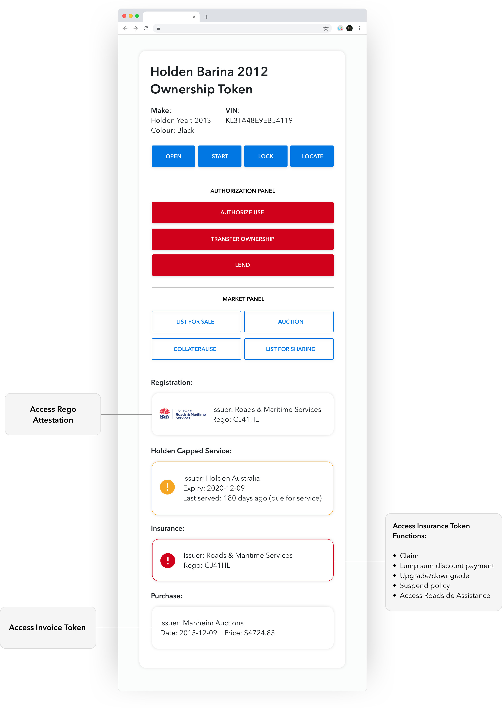
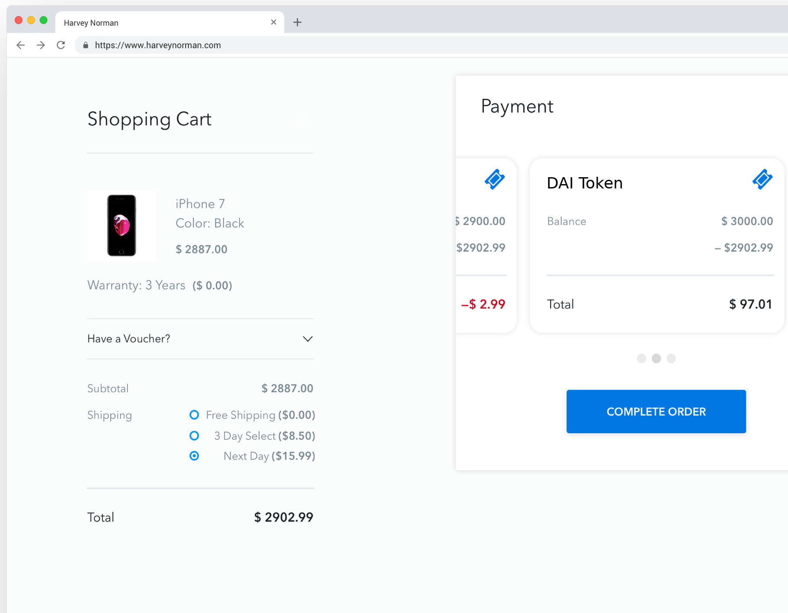
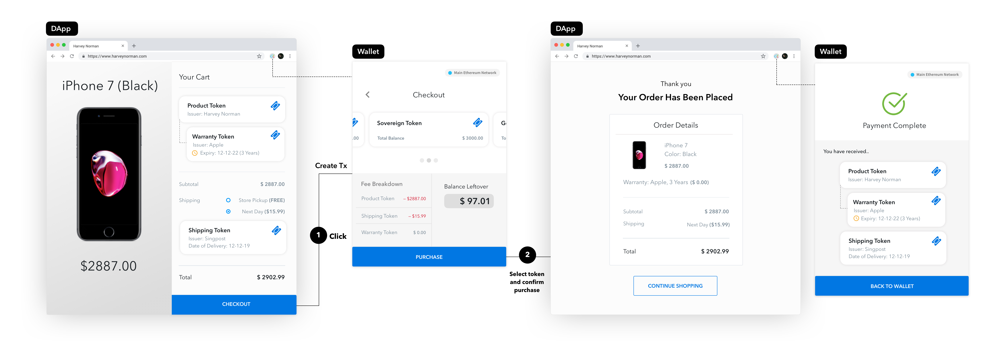
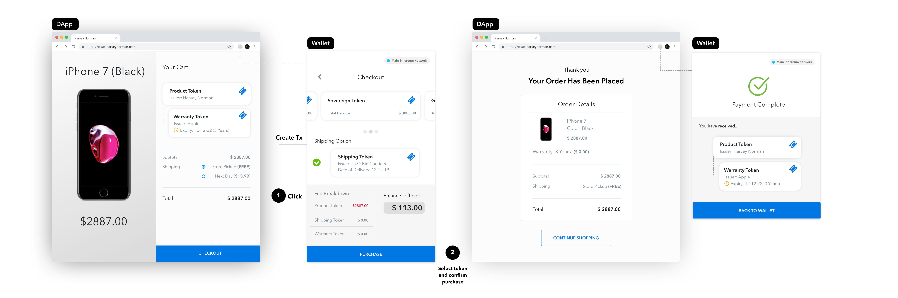

# TokenScript Design Paper

## Author's note

The remarkable blockchain speculations that took place in 2017 - 2018 brought everyone's attention to crypto tokens. As we bought and sold them, we forgot their intended purpose was to be used; this is analogous to the housing bubble in which people forgot that houses were not merely speculative assets but rather a place to live.

Blockchain serves the role of the trusted third parties. To derive its practical use, knowing its role is not enough, we must understand its utility to the world economy and the Internet. The authors of this paper are technical experts who went through years of research and experimentation into its applications both via financial institutions and startups. With this experience, we came to realise that blockchain - as the trusted third parties - can achieve two primary functions:

1. It provides a frictionless market. 

2. It integrates the web.

Despite the great folly in 2017-2018, it is not a bad thing to initially focus on tokens. Tokens are the enabler of the two primary functions. We define the technique to make it happen in "Tokenisation".

Tokenised rights can be traded on the market and integrated across systems, forming a frictionless market and allowing limitless integration.

Previous efforts in this industry primarily focused on enhancing the technical dimensions like transaction throughput. This project will focus on tokenisation which serves in the functional dimension. We introduce a standardisation effort known as TokenScript which will make the blockchain technical stack complete, providing utility for the economy and the internet.

Please join our work at tokenscript.org. A Yellow Paper to guide implementors to use TokenScript for their tokens and dapps will take months to make, but a work in progress is always available online. Participate now to prevent the draft specification derail from a valuable use case in your knowledge.

\pagebreak

## Table of Contents

- [Author's note](#authors-note)
- [Abstract](#abstract)
- [Introduction: What does blockchain <em>do</em>?](#introduction-what-does-blockchain-do)
    - [Creating a frictionless market](#creating-a-frictionless-market)
    - [Blockchain integrates the web](#blockchain-integrates-the-web)
    - [Example: Car Ownership Token](#example-car-ownership-token)
    - [Why TokenScript](#why-tokenscript)
- [Design requirements](#design-requirements)
    - [Address "Frictionless Market" needs](#address-frictionless-market-needs)
    - [Payment side example: DAI token](#payment-side-example-dai-token)
    - [Address the "Integrate the web" need](#address-the-integrate-the-web-need)
- [The design of TokenScript](#the-design-of-tokenscript)
    - [Relate tokens to smart contract and tokens to web services](#relate-tokens-to-smart-contract-and-tokens-to-web-services)
    - [Types of tokens](#types-of-tokens)
    - [Attestations](#attestations)
- [The components of TokenScript](#the-components-of-tokenscript)
    - [Actions](#actions)
    - [Magic links](#magic-links)
    - [Attestations](#attestations-1)
    - [Assets](#assets)
- [Join the game](#join-the-game)

# Abstract

We recognise the blockchain technology's utility in providing a frictionless market and integrating the web. This is done through tokenisation. Tokenised rights can be traded on the market and integrated across systems, forming a frictionless market and allowing limitless and accountless integration.

Today, the ways tokens are accessed, rendered and transacted are scattered across dynamic Dapps and immutable Smart Contracts on the blockchain. Most tokens either have a very primitive business logic or try to put complex logic into the contract to cater the interactions with the token. This adds complexity and security issues, while hardly addressing all potential business patterns in advance. When marketisation and integration of a token is tied to a dapp, it recreates data interoperability, security and availability barrier - the same issues that prevented tokenisation before blockchain's invention.

Therefore, we introduce TokenScript, a program interface for tokenisation. It abstracts out the token information, access methods and UI rendering so that they can be efficiently marketised and used for integration. TokenScript allows token logic and rendering to be separated out of the "host", allows token to be easily portable and market to be created for it. It allows different token providers to not only describe the features of their tokens but also how they are allowed to “act”, e.g. transferability. The crux of the idea is that such a markup description can be updated at any time by the token issuer and retroactively reflect the behaviour of already issued tokens. Besides allowing easy interoperability between different token providers, this also eliminates the need to update the DApp or smart contract whenever the business logic of a particular type of token changes.

Specifically, TokenScript is an XML dialect. It describes the functions provided by the token (through smart contract or not), the method to render it on the user's interface, and the JavaScript needed to construct transactions and render the token.

\pagebreak

# Introduction: What does blockchain *do*?

Blockchain technology has two primary functions that serve essential purposes for the future economy and the future Internet:

- providing a frictionless market; and
- integrating the web.

This paper addresses the vision of where we can be and follow up with the design and reasoning behind the architecture needed on top of the blockchain. We explain TokenScript which is a critical missing layer and go over its design principles and how we are building it.

## Creating a frictionless market

The 80s' "Back to the Future" featured a world of powerful machines filled with hovering boards and flying cars. It didn't happen. As Peter Thiel once famously lamented, "we were promised flying cars; instead, we got 140 characters". The technological advancement of our time is beyond the imagination of the 80s science fiction movies, albeit not through more powerful machinery, but efficient use of the Internet.

Ride-sharing revolutionised the way we organise our daily lives, and AirBNB changed the way we travel. These are the new, less frictional markets. They incur less cost to operate, are more accessible and have finer operational units.

However, despite this web 2.0 revolution, the majority of markets still operate with high costs. The stock market, for example, has so much overhead that it is only justifiable for multi-million dollar businesses to afford to operate under the rules and regulations.

With blockchain, any tokenised asset can be fastly transacted any time, as long as it follows the rules, without an intermediary or the process to "enter the market", eliminating frictions and enabling maximum market efficiency.

With the traditional intermediary-operated market model, a trade is made in two stages: entering the market, making a deal. Blockchain can simplify that into a protocol; therefore the blockchain token assets can be considered *always on the market*.

### Tokenised Assets

Can we tokenise 1% of a property, so that we have a finer property market with lower entry thresholds, which react faster than the typical month-long property purchase-sales cycle? Can token create a market of granular investments in all kind of resources?

Can we tokenise electricity, allowing power users to benefit from finer scheduling of the use of resources, and households to benefit from collecting surplus sun energy? 

Can we tokenise AirBNB bookings, so that hosts can purchase a guaranteed cash flow from the market, while speculators profit from predicting the travel needs?

Can we tokenise the risk and reward of international trades, so that small importers and exports, not significant enough to obtain letters of credit, can compete in global markets? 

Can we tokenise books, content and intellectual property, creating liquid markets for them?

Can we create an insurance token that depends on cryptographic proofs, so that the insurer can remove the costs incurred by fraudulent documents from the pricing? Can we decentralise the insurers altogether?

Blockchain can provide the foundational layer to achieve these. It enables a working, frictionless market with tokenised assets *always on the market*. However, this can only become true when there is a reliable and precise method to define how tokens should be used and transacted. This the focus of our work on TokenScript. 

To carve out the difference, we look at how Tokens are used today.

### Payment Token and deliverable Token

In 2017-2018 we did end up having hundreds of tokens. However, they uniformly fall into one category of token: created with the ERC20 standard they are currency-like, filling up the *payment side* of the market. There is nearly zero effort devoted to making tokens *goods and services* - which is the *deliverable side* of the market and a fundamental need for a market to work.

We categorise tokens as payment tokens and deliverable tokens. ERC20 tokens bearing the hallmarks of *payment tokens* only fills one side of the market with tokens. They can't lift the market, as they merely compete with other payment-token - like Bitcoin or Ether - on the payment side. They represent a good, but they do not actually deliver. They are rather like gift cards.

During the speculative bubble of 2017, an energy token ICO did not need to provide any explanation of how the tokens can be used. All speculators needed to know is that they represent for example a "stake in the future world of tokenised electricity". As long as the token can inspire investors with imagination, it's good enough for an ICO. There is no more functionality needed other than an ERC20 interface. 

Such a speculative token didn't depend on attestations - the proof of actual power production - nor did it need properties like where the energy is provided or for how long it is available. Instead of enabling a frictionless market, those tokens have just been a promise on enabling it, which has been sold as a gift card. By far most will never deliver.

Now that the madness is over, it's time to present the technical framework to make the market actually work.

### Token properties

Tokens can be products. Therefore, they need to have different properties: Do tokens expire? AirBNB booking tokens certainly do, but 1% ownership of property tokens probably don't. Should the token owner receive a notification on a specific event? An energy token needs that, for the change in the power supply is dynamic. Is a token stream-able?

How does it look on the user's mobile, and how is it called in a users language? If a buyer wants to purchase a tokenised country estate from a seller, how do they establish a trusted method of communication? If a token entitles the user to do specific actions online, how can the user login to the web services with that token?

It's easy to see the need for an open framework defining tokens and making them interoperable with different methods of trading, listing and rating. TokenScript provides such a framework. It overcomes the limitation of the approach to put everything in a smart contract or a set of smart contracts.

However, to diligently design it we need to consider the second part of what Blockchains can do: Integrate the web.

## Blockchain integrates the web

### The problem of the internet as we know it

Tim Berners-Lee and the innovators of the world wide web modelled the web primarily on a) the public library model and b) the computer-human interaction model.

a. In the library model, information is freely available, indexed and cross-referenced by a URI. Its incarnation, the URL, is where the data is, and there is no restriction on where you can go.

b. In the computer-human interaction model, two players are having a conversation - the human asks and the machine answers. A computer has limited knowledge, but it can help the user to reach the right computer.

Therefore, the web was built as a giant library where each book is a computer with whom one can have a conversation. 

This design has caused a lot of modern inconveniences. A user would one day receive an email on her monthly statement, yet she couldn't recognise a few entries on them. It says "Amazon". Was it about ordering a pair of shoes? She has to copy the order number and look it up in Amazon. The same user might pause as she books two tickets for an opera, switch to her frequent flyer app, copy that number over and paste it into the order to collect the points. She might struggle a bit installing that frequent flyer app at the outset. When she buys on another webshop, she needs to download another app or create another account.

Why are we doing so much copy and pasting when machines are exceptionally good at doing this? Owning to the design, the web is like a giant library, and we are like readers keeping notes of the index numbers under our sleeves. We hope that in the future the Web resembles no longer of a library, but more like a personal assistant. 

### The client side can't integrate a web that is not designed to integrate

Surprisingly, even the technology that was created to fill the role of a personal assistant, the Smart Phone, still failed for the same reasons: the efforts from client side alone can't integrate a Web that is not designed to integrate. It made the problem even worse, as copy-pasting becomes bigger trouble when using a Smart Phone.

The truth is: Not only the client but the infrastructure has to support integration. A smartphone is modelled after a dial-up Internet connection, with each app representing a website. The users still need to figure out which computer (app) to talk to before entering the conversation, and still copies information around as he swaps apps around. It's therefore not possible, for example, to ask your smartphone to sum up all the money one may access by his online banking apps.

It's easy to see the cause of the inconvenience: the web is poorly integrated. The bad examples go on and on:

- When a user checks out on the web, she isn't sure if she has enough balance on her card, since the bank is not integrated with the shopping system.

- When a patient orders a service, she can't see how much the insurance can cover until the bill settles, nor can she know whether she has reached the annual cap since the clinic is not integrated with the health insurance company.

Such integrations can be addressed by having a backend connection between the two service providers, but it is not often done, because it requires the parties to collaborate and negotiate a value distribution. The collaboration depends on the security (takedown system A through system B), availability (one went offline while the other serving customers), scalability (*n²-n* integrations needed for *n* parties). Furthermore, such integration restraining the free market in two ways. First, the competition will be on integration, not goods and services. An insurance company which integrated their systems to more clinics competes against a new insurance company on the ground of integration, not coverage and premium. Second, it doesn't allow integration between contending parties, and it requires permission from both side of the integration to work.

The challenge to integrating the web requires a few building blocks that weren't in the Web's blueprint: authentication, ownership, transfer of value and trading.

### "Account authentication" is not a substitute for web integration.

The web doesn't have a built-in authentication mechanism[^tls]. To route around this gab, many users use add-ons like "Sign in with Facebook". Those merely try to provide authentication through a trusted 3rd party, which does not only cause privacy and availability concerns but also only serves for account authentication and can't be used for integration.

[^tls]: There have been excellent efforts on client/server certificates in Transport Layer Security (TLS). However, these authentication methods are not for processes, but only for sites. They represent a delegation model: Imagine a buyer not checking if a title deed is real, but only checks if the seller's name matches the one on the deed. That would be the delegation model used in TLS. In this model, TLS can't guarantee that anything on the website is genuine -- only that the website itself is. Facebook uses TLS, but people put much fake news on it. The unit of trust here is undoubtedly not granular enough for the web to deliver an integrated experience.

On top of it, the model of account based authentication is the cause of further problems. Most simple business cases - for example, "the owner of a car checks its service history" - don't require an account. Truthfully, accounts are stopgaps to problems created by the specific structure of the Internet as we know it.

If you enforce parties involved having an account to authenticate, bad things happen:

- When the car is sold, the new car owner would now need to create a new account at the service website and secure it with the proof of ownership to the car. This is onerous and unreliable.

- When a 3rd party like a Vehicle Modification workshop or an insurer needs to access the repair history, there is no easy way to authorise them without giving away the account. This is inflexible.

Such integration needs, poorly addressed by adding accounts, are easily found in healthcare, retail and almost every web-based business. Today, we are still adding more and more accounts to address the growing integration needs. It's a case of hammering every problem down as if it is a nail. Most people do not feel well with this model but don't see an alternative to integrating the web. An internet without accounts is beyond most people's imagination.

We  demonstrate that integration through token is a superior solution to integrate the internet. A vital element of this process is ownership.

### The lack of an ownership mechanism 

The web doesn't have a built-in mechanism for ownership, transfer of value and trading.

To demonstrate, we take the car story a bit further: When you want to sell your car, you need to post the car information on a website. To do so, you must create an account on the way. When someone wants to buy your car, you and the buyer have to go through a chain of processes: Insurance, unused service quota, vehicle registrations, documentation handover, payment and so on. All these actions have to be done separately, using easily-tampered paper proofs and forms and accounts. The process starts at the web and ends somewhere else instead of being automatically done after the buyer clicked "buy".

Is it possible to make it happen, that the entire chain of bureaucratic procedures happens securely in the backend, while you just push the "buy" button? With the web of accounts, you'd need to knot together a lot of accounts and trusted third parties, which hide the process from the user, while they fulfill the same paper trail as before.*

In contrast, when you base the same process on a blockchain and on tokens, it would be automatic, fraud-proof[^attestations] and atomic[^atomic]. You could finish a car sell with one click in a secure way without the need for accounts and paper trails.

[^attestations]: the method to provide cryptographically signed attestations as a condition for a transaction is discussed later in the "Attestation" chapter.

[^atomic]: In blockchain terms, an atomic transaction either happens or not. If well defined, it's not impossible for a buyer to have successfully paid for a car yet not getting the ownership token, or only have transferred the car's ownership but not the compulsory insurance on it.

These missing features of the web are the well-known functions of the blockchain. A blockchain is an immutable, decentralized record of ownership, sometimes called a "triple-entry bookkeeping" system. The virtual wedding of this perfect fit couple requires a virtual exchange of tokens, or what this paper called "tokenisation".

To do so, Token must seamlessly go across systems, carry their trading rules and user interfaces and business context.

## Example: Car Ownership Token

We combine the two concepts: a frictionless market, achieved by tokenising assets; and the integration of the web, by using the token as an integration point for web services. We demonstrate with an example that encompasses both concepts: car token. This is just one of many examples. You can transfer the concepts on nearly everything, including real estate markets, any kind of b2b and resource transfer - every transaction which involves digital goods or a digital representation of physical good.

The car example is meant to help understand the concepts. On the one hand, a car is a tokenised asset, that can be bought, sold, transferred, auctioned, collaborated and insured, all enabled by blockchain. 

On the other hand, a car also has utility. A car's ownership token can convert a blockchain wallet into a car key, with additional functions like graphically representing the car's current location. Authorising someone to access your car, or renting it for profit, would be seamlessly done by signing blockchain transactions or attestations, without passing car keys around.

In both cases, the token represents the delivery side of things: They *are* the product. Those token can interact with a non-token kind of payment, but tokenising the payments would make the whole process much more fluent.

The following screenshot of a car token represents the final stage of tokenisation.

At first glance, it is just a handy portal to do everything about the car, including market functions and utility. However, it's not possible with the traditional web model. In the web 2.0 model, you are restricted to handling every element on its own:

* To register the car, there is a separate process which involves creating an account with the Road and Maritime Services and proving ownership manually without the aid of cryptography. 
* When you want to provide insurance to the car, you have to create another account and manually offer proof of its registration to that new service. 
* Likewise, if you want to make the car available to share economy through Uber or hour-based car rental, the work of proving and settling payments and insurance cost adds friction to the market.

The intended portal does not enable those functions by itself but merely serves as a gateway to merge a lot of different accounts as we know it from the internet of today. It's just another stopgap, which hides paper trail processes from the user, without solving the underlying problem.

Now let's reimagine this in the web3 world whereby such elements can be tokenised, step by step: 

__Buying and registration__: The Vendor (in this case Holden) provides an ownership token to the new owner which can be used to operate the car. The token, transferred to the owner at the time of purchase, is in turn used to acquire the registration token. An inbuilt IoT device allows the car to be operated with proof of ownership via a token.

__Insurance:__ The owner, wishing to purchase insurance, only needs to provide the proof of ownership and registration token to be qualified to fulfill the requirements with the insurance company. The insurance companies standards are met automatically by matching the tokens to their requirements and once validated; the insurance company can send the owner an insurance token in exchange for payment. The insurance token carries its own functions and services.

Token build the join between different providers and services, which are used to be built by accounts, trust and paperwork.

__Uber:__ If the owner would like to become an Uber driver, she can easily prove her vehicle is good enough by providing proof of ownership, insurance and registration with her tokens. Uber then automatically provides her with an Uber token which, depending on the owner's need, can be used to get himself started as an Uber driver or allow a 3rd party driver to do so. None of these processes requires manual verification or account creation.

Token enable a more flexible, even programmable, use of ownership rights and their interaction, as centralised, account-based services can provide.

__Self-Uber:__ Taking this even further, the owner can skip Uber all together and rent her car directly to strangers. Not wanting her car to be trashed by some random stranger, she can restrict her renters to those who have an attestation token issued by the 'better drivers bureau'. The renter proves they have this token, pays a sum to the owner and is atomically issued with a temporary token that allows them to unlock and use the car for a certain period of time. This is done without the creation of an account or needs to submit tons of documents to be validated manually by the owner.

__Selling:__ If the owner wishes to sell the car, she only has to list it on any website with a price. The ownership token and payment can be swapped atomically (ensuring neither the buyer nor seller is cheated) and the new owner can drive away with the car without even meeting the original owner face to face. The new buyer knows in advance whether the car has been registered and is legally owned by merely validating the original owner's ownership token in their wallet. The original owner's token is invalidated once the swap occurs and she can no longer operate the car. It is also possible to automatically void the insurance policy once the exchange has occurred and provide the original owner with a rebate for premature cancellation.

This chapter serves to present the vision. Token enable the whole ownership and utility processes around car trading and sharing to happen automatically, fraud-proof and atomic. This eliminates a lot of friction and allows much more flexibility to individualize the economic transactions.

We will have the opportunity to inspect the technical aspect of this well-integrated well-tokenised car token in later chapters again.

--

## Why TokenScript

### The challenge of tokenisation

The car ownership example demonstrates the power of tokenization to erect a frictionless market and to integrate digital services. For many markets it is a new paradigm. However, the way tokens are used today, as it manifested in the ICO hype of 2017/18, is far off from providing what we call tokenization. Most token don't even try to be more than a surplacement for the payment side.

To unleash their potential, tokens need to become a lot more sophisticated and fill the delivery side. A Token protocol must fulfill several requirements:

**Richness**

Tokenization needs an endless variety of tokens, which are tailored for their individual usecase. This requires bundling the tokens with their *transactions rules* and *behaviour patterns*. New tokens should be able to enter the ecosystem on an abstracted layer, so that they can be traded and used in *different contexts*. With the anticipated proliferation of new plasma subnets, token should also be able to seamlessly operate on them. 

**Embeddedness**

Tokenisation must allow users to interact with different systems through the tokens. In the car example, the car token contains code to interact with a *smart lock* (the *Open*, *Start*, *Lock* actions) and the maker's own *web service* (the *Locate* action). The *List for sharing* is provided by *another third party service* which tokenises the usage of the car by hours or days and sells them piecemeal. The token must be embedded in different environments and used by different services - while the owner must be able to access all these markets solely through this Token.  

A token must also be renderable and associated with the actions it can perform in the user's wallet. In the car example, if the registration expired, the web component at work would paint the Registration Token red or display a warning. Actions like *List for sharing* will not be available with an expired car rego, and the integrated token interface should clearly pass that message to the user. Token must be rendered differently according to what happened to them in the user's wallet. Tokenization requires the wallets to correctly react on a large variety of token events.

**Flexibility**

It must allow new protocols to be developed on tokens. A token never has a finished state. There are always options to attach new protocols to it. In the property example, collateralization might be something wishful to add later, as well as identity information or the ability to transfer the token through plasma state channels. This has to reflect in the user interface, thus there must be a way to deploy trusted code to the user-agent's wallet or prefered dapp.

**Trust**

A token must carry trust relationship and business context to 3rd parties. In the car example, the insurance token provides Roadside Assistance service through NRMA. The driver might be able to access this through the token of his insurance provider and immediately be identified as qualified for help. In both examples the token must carry trust relationships, which shouldn't depend on the availability of a certain service, but passed directly by the token. Both business context as well as the relationship must be part of the token, while being highly available, private and integrative. [^abc].

[^abc]: Availability: NRMA is online 24/7 but Qantas Insurance can suspend their services in public holidays or at night. Privacy: NRMA can learn user's GPS location but Qantas Insurance isn't legally allowed to learn it. Integration: Most of NRMA's customers are not obtained through Qantas Insurance, so it would be an additional system to integrate and extra security concern for NRMA to integrate to Qantas Insurance's web service. Of all three, availability might be the most visible. Just imagine how angry a customer will be, having his car breaking down in the middle of the barren Australian outback, and learn that the road-side assistance can't be authorised because the insurer's web service is upgrading "For a better user experience".

### The problems of legacy tokens

Early public blockchain projects attempted to implement both token logic and business process into smart contracts. Using an online retail project as an example, such a smart contract would not only process an order but also manages the inventory. The token transaction logic, like under what condition the transaction is valid, is tied with business process, like checking inventory. This method is, naturally, inherited from the way people build websites.

Using an analogy to demonstrate the inappropriate method, suppose an IKEA manager decides to format the furniture sales contract to include information like which aisle a patron should go to fetch the furniture package, would it work in real life? Of course not, the contract would have to be modified too many times to reflect Ikea warehouse management; which aisle has the product has no impact on the validity of the trade.

We argue that this method is not suitable for creating a frictionless market and integrating the web. Fulfilling the challenges with the conventional token model is difficult, often nearly impossible, while it adds complexity and causing scalability, interoperability and security issues:

**Richness** 

In the world of Ethereum - the de facto standard for token - richness of Token is usually created with DApps: The business logic of a token - all kind of applications - are coded in a smart contract, and centralized websites enable users to access the contract. For example, you have an ERC721 crypto kitty token. To use it you must access the cryptokitties website.   
   This method requires the designers to fetch all possible business scenarios before creating the smart contract. As the future is rarely predictable, this method is problematic. It makes it also hard to develop a business model by trial and error. At the same time, it adds a lot of complexity to the code, which often causes security issues. After the DAO was hacked, the Ethereum community restricted itself to only implement relatively limited behavior patterns in smart contracts.    
   So the result is that Token developer need to restrict the scope of richness, but still add security problems. 

**Embeddedness** 

Ethereum token have a very limited way of interacting with other systems like wallets or dapps. If the logic of interaction is part of the smart contract, we have the problems explained above. *and* must deal with the fact that you hardly can represent all systems language in one contract. It is impossible to do this without the help of external frameworks.    
   Currently this is mostly solved by hosted DApps on websites, which structure the interaction between users and smart contracts. Such DApps have made it possible for users to access relatively advanced smart contracts like CryptoKitties and other token based games. However, this reintroduces the centralization problems Blockchain was made to solve. We will address the problems of hosted DApps soon.       
   A similar problem is the integration in a wallet. Events in the token history must trigger actions in the user interface. It is hard to do this, when the smart contract doesn't define the behaviour of all those systems in a way they understand. It's also hard to do so when a contract is upgraded. The usual solution is, again, to use a hosted DApp instead of a wallet under the user's control.

**Flexibility* 

The inflexibility and immutability of a smart contract tokens makes it hard to develop new protocols for it, especially when those protocols are not known when the contract is written. You will also need your smart contract to interact with other smart contracts in a way you can't predict when designing it.   
   This could end with a locked-in-state of the token on one certain protocol. It could also introduce trusted third parties to migrate to other protocols or to interact with other smart contracts or tokens.     
   On Ethereum, there are methods to upgrade a smart contract. They usually add a lot of complexity to the original smart contract and introduce another smart contracts which performs the upgrade onchain. This approach increases the complexity of the smart contract system, which causes security issues. An example is the multisig contract of Parity, one of the most advanced implementations of Ethereum. Even their developers failed to make the contract secure, resulting in one of the largest losses in the history of Ethereum.
   
**Trust**

To be used in a wide scope of business activities, Tokens must carry trust relationships. With the legacy token model this casts two problems: First, you will have to input private data on a blockchain, which has, even when encrypted, several risks. Second, you need to carry the relationship over a hosted DApp, which means you are dependent on a website being online. If one part of a chain of trust relationships is offline, your token will not work.

In summary: Tokens on Ethereum suffer from having their entire functionality derived from a smart contract. This introduces inflexibility, complexity, security and privacy issues and a lack of interoperability. Relying on the legacy model drastically increases the resources to launch a new token, while making it hard to adjust the business logic to the real economy. Another major issue is that it is close to impossible to reflect the full functionality of a token in a wallet, especially when token events must create wallet events or you have to deal with intertwined smart contract events. These problems result in business' striving to integrate markets by *using* token, but ending with spending all resources on *developing* smart contracts.

Most of these shortcomings have one common denominator: There is a missing link between the smart contract and the user. This depreciates the functionality of the smart contracts and reintroduces centralized hosted DApps filling the gap. 

### The problem of hosted DApps

If you use advanced smart contracts today, you usually access them through a website, which is called a hosted DApp. For example, smart contracts like CryptoKitties or the 0x exchange protocol don't need a trusted third party to serve its functionality - in theory. In practice Ethereum wallets fail to represent the logic and the action options of these smart contracts in a user friendly way. The result is that much of the advantages which blockchain enables are lost.

Hosted DApps have several shortcomings: They introduce a trusted third party. The website owner can render and manipulate data and block users from accessing the dapp. The user also has to rely on the third party website to stay available and updated, to not leak private data and to not be hacked. The backend of the DApps is decentralized and trustless - but the frontend is as centralized and trusted as traditional websites.  

Even more problematic: You can't integrate the web via tokens instead of accounts or websites, when you rely on hosted DApps. When you need to use advanced business logic of smart contracts, like passing your car token to the road service which uses it to check your insurance policy, you must use the DApps, as well as road service and the insurance company. It is exactly the same model as we know from the web as we know it: The information might be attached to the token - but the way, information is passed, still relies on centralized websites.

This is why we introduce an alternative approach to handle the user interaction with smart contracts and tokens. 

### TokenScript as a solution

We propose TokenScript as a solution to overcome the shortcomings of the legacy token model.

TokenScript is a program interface for tokenisation. It is an XML dialect, which describes the functions of the token and the method to interact and render it on the user interface. It serves two purposes: It helps the user to access the token's full functionality - and it allows the creation of more advanced and complex user-token-interactions. 

The XML dialect can be easily read by any device and software without the need to pull it into the core of the wallet structuring the interaction with the blockchain. It's also possible to use TokenScript to perform token actions on another protocol, without the need to migrate the token smart contract.

Basically, TokenScript puts a lot of information offchain, while the core of the token design remains on the chain. As  TokenScript (and every update) is signed by the token issuer, it is as verifiable as the smart contract itself, while being a set of shared data between the token issuer and it's users. In the context of current blockchain terminology it could be described as a *Layer 2* technology for the interaction with token. 

You can imagine it by thinking on a computer program for your music files: Like the token on a blockchain, the music files remain the same, but the software for playing them can change. It can be automatically updated to eliminate a bug, or it can change to allow new features, like recording, cutting or fine-tuning the audio frequencies or putting it in a library of your favorite songs. TokenScript is the hinge which connects the software with the token and makes sure that the interaction of both is not arbitrary, but structured by the issuer of the token.

To explain TokenScript in more details, we will sketch out design requirements by applying the concept on examples.

# Design requirements

To understand the requirements for TokenScript, we will first introduce basic concepts about markets, marketplaces, payments and deliverables. Then we will use a real estate example to learn what a token markup language needs to be capable of. 

## Address "Frictionless Market" needs

To find out the requirements for TokenScript to create a frictionless market, we need to have a formal definition of markets and the concepts involved. In our case *a market is a place where delivery versus payment* happens. The role of Blockchain is to make markets rely less on middlemen and eliminate frictions. 

For clarity, we define the three concepts involved. 

*Deliverables*: All sorts of things money can buy: assets, goods and services. In this context deliverables are not a physical good, but an entitlement. A proto-tokenization of deliverables happened long ago, like land or security titles. However, only with blockchain they can be transfered in real-time without needing a third party to prevent double spends. Deliverables can profit immensely from tokenization - if the token design properly reflects their needs.

*Payments*: All value transfers done with anything currency-like. In traditional markets payments are done with Fiat currencies, either as physical banknotes or as electronic transfers through trusted third parties. Blockchain eliminates the middle men from payments and enables the use of programmable currencies like Ether or Dai.

*Market*: Is a concept of individuals exchanges payments versus deliverables. It is neither meant as a single marketplace nor the entirety of all marketplaces. To access a market users can, but most not be on a marketplace like Amazon. 

In traditional markets both *the deliverable* and *the payment* side tokens must "plug-in" to the *market*. The market participant must transfer both parts of a deal to the market, which adds friction and introduces middle men. The promise of Tokenization is that both deliverable and payments are *always on the market*. 

Enabling this is a main requirement for TokenScript. To do so, TokenScript enable tokens to be presented, indexed, transacted, traded, auctioned, combined and so on. We will demonstrate this requirement by both an example for delivery and payment and explain how TokenScript can address this needs.

### Deliverable side example: 1% property token

Let's imagine a market for "1% property". A property owner can issue many pieces of a token, each representing 1% ownership of the property. He can sell these tokens for cash. A buyer needs to know quite a bit of information. It's easy to understand that such a token would fetch 1% of the sales revenue if the underlying property is sold, but a lot more details are needed:

1. Where is the property and what status is it in?

2. Can a 1% property token owner vote?  For example, on the purchase decision to insurance against a bush fire?

3. Is the 1% automatically converted into currency at the time of property sales, or can the token holder elect to continue holding it?

4. Is the token properly underwritten to prevent double-collateralization?

5. If the property was collateralized for a mortgage, what is the condition for a liquidation event?

6. Is providing a buyer's identity attestation a condition of a purchase?

7. Is the seller the actual owner of the property?

8. What was the performance of similar properties in the region in the past years?

9. What was the historical sales price of this property?

Specific to blockchain, we also have:

10. How to correctly and securely construct a transaction for the asset (purchase, voting etc)? You can't expect any investor to be a blockchain geek who knows how to load the smart contract files in his wallet.

We categorise these trade-sensitive information into four categories:

1. Product description[^pd]: Item 2, 3, 5, 6
2. Attested information (attestations): Item 1, 4, 6, 7.
3. Reference information: Item 8, 9.
4. Action information (how to perform an asset action): Item 10.

Understandably, the buyers need to access all these for an informed decision. To allow tokenization of deliverables to happen, these informations must show up on his wallet when he starts interacting with the token. In the following chapters, we will describe how these informations categorizes manifest in TokenScript.

[^pd] The word is loaned from the financial sector, usually used to describe packaged investment products. It means the formula which profit is calculated and the current values of the variables in the formula.

#### Product description

Product description information is typically part of the smart contract. They can be obtained by making a few Smart Contract function calls, therefore, the only needed work is to convert them into a presentation. Usually, this means translating them to the language user speaks and converting "True" value into a nicely ticked checkbox. 

This serves to introduce the first functionality of TokenScript: acting as a presentation layer for smart-contracts. In XML it looks like this:

    <attribute-type id="voting-right">
       <name xml:lang="en">Voting right</name>
       <name xml:lang="zh">投標權</name>
       <origin contract="holding-contract" as="mapping">
          <function name="getVotingRight">
	     <inputs>
	        <uint256 ref="TokenId"/>
	     </inputs>
	  </function>
          <mapping>
	     <option key="0">
	         <value xml:lang="en">No Voting Right</value>
		 <value xml:lang="zh">無投標權</value>
             </option>
	     <option key="1">
	         <value xml:lang="en">Voting rights on sale</value>
		 <value xml:lang="zh">可投標決定售出</value>
	     </option>
	     <option key="2">
	         <value xml:lang="en">Voting rights on expense (e.g. insurance)</value>
		 <value xml:lang="zh">可投標決定維護項目如添置保險</value>
	     </option>
	  </mapping>
	</origin>
    </attribute-type>

This simplified `attribute-type` code snippet allows the value for Voting Right to be fetched from `holding-contract`, which is a smart contract defined somewhere else in the TokenScript, and present it in one of a few languages.

As another functionality, TokenScript can extend the product description and integrate variable parts, which can be upgraded without messing with upgradability of smart contracts.

#### Attested information

Attestation is just a signed message stating a fact. Attestations are often used to satisfy the conditions of the transactions — more on that in chapter Attestations. In the 1% property token example, the involved attestations are:

- The Identity authority and title deeds office attest the issuer's ownership of the property.
- A collateralization authority[^set-operation] prevents double collateralization
- The buyers provide their identity or capacity to invest in this type of asset

[^set-operation]: Eventually, this could be a cryptographic set operation, but even if that happens, the metadata directing the context (user-agent) to perform the computation still needs to be described in TokenScript.

The first two attestations are not stored in a smart contract for privacy and cost (size and number of transactions) reasons. It's possible to utilise zero-knowledge proof to provide anonymous proof that the attestation is for the said property and said owner, and it has not expired. What proofs are expected and can be validated is also described in TokenScript.

Furthermore, the transaction requires an identity attestation or investment capacity attestation from the buyers. These are described in TokenScript as well so the context (e.g. user-agent) can prevent the user from submitting a transaction without qualifying proof or help the user to select suitable attestations for a purchase transaction.

TokenScript does not just help relay the attestation data, but it also enables wallets to conveniently allow buyers and sellers to submit and read the attestation data without the need for a hosted DApp service.

<!--- add an xml example for consistency]] -->

#### Reference information

Reference information is relevant to the token, but not part of the smart contract. In our example reference information includes data like previous property sales price or regional property performance. This is data which is useful for the owner or buyer of a token. It is provided by web services, typically through a RESTful API call.[^trusted-information]

[^trusted-information]: Originally we call it "Trusted information", meaning the data is just "provided", without blockchain proofs or attestations, hence, it has to be explicitly trusted by the user. As it turned out, this term misfired as some developers think it means "proven information" and provided as trusted already. So we used a less precise term "Reference information", which, unfortunately, feels like a catch-all phrase.

It could be possible that eventually such information will end up being onchained. But even than they will be created and uploaded by an entity which has to be trusted. Reference data always leads to the problem of trust and web integration. With TokenScript this data is signed by the token issuer (not by the token owner - the token issuer is often an entity that deployed the smart contract). In the case of the property this could be a real estate specialist. The reference information sourced from web APIs specified in TokenScript is assumed to be trusted, but can be changed later. The security chapter will detail different levels of trust.

<!--- add an xml example for consistency -->

Today, all such information related to a token is usually held together on a DAPP website made by the same entity that deployed the token. This has the shortcoming that the DAPP is only useful when the API is still available and reliable. Having it not in the smart contract but in TokenScript enables the token issuer to change the API source. 

Thus, we argue that for tokens to be effectively marketized, reference information needs to be abstracted out and placed in the token behaviour language TokenScript.

#### Action information

Action information dictates the correct method to construct a blockchain transaction, like:

- What attestations are needed to prove the buyer's capacity to purchase?
- What parameters are needed for a purchase (e.g. number of 1% shares)?
- How to render the purchase form and translate to the user's local language?
- Are the conditions all met (e.g. a purchase isn't possible after the underlying property is liquidated)?
- How to cast a vote if one is aligned with token ownership?

In Ethereum this information is a super-set of the smart contract programmable interface called ABI. It also contains business logic (e.g. property must be still valid and owned by the seller) and presentation logic (e.g. the message "The property is liquidated. Purchase no longer possible"). With more sophisticated token, this parts becomes more complex and will make it hard  to load it in a smart contract *and* visualize it appropriately in the wallet. 

TokenScript makes both the content as the visualization of the action information more flexible and accessible. 

<!--- add an xml example for consistency -->

<!--- Why not just use ABI? - I speculated -->

In conclusion, TokenScript allows the context (user-agent or trading engine) to:

- Fetch token related information from its holding smart contract, attestations and references.
- Produce a visual or audio rendering of the token
- Produce a list of actions that can be performed and explain how to construct the transactions.

Any party is able to render and apply functions to the token using TokenScript, including entities like generic marketplaces, user-agents and 3rd party apps. We call these parties "context" in general.

## Payment side example: Smart money

Similar to the delivery side, a token economy needs to bring an advanced business logic to the payment side. With payment we mean a token representing a monetary unit used to pay for deliverables. In our case, this are programmable token like DAI or ETH.

If we look at our property example, we see the need for some payment functions not available in current wallets: Maybe a payer needs to provide an identity proof with a payment when he buys a property share. On the other side, the property token issuer might want to create recurring payouts of the income of the 1% token. If someone builds a platform to tokenize property shares, the owners will need an easy way to integrate those kinds of payments. Further, paying for a property share might include multisig-payments, which introduce trusted third parties like notaries. A property trading platform might want to link payments to a list of certified notaries.

If we think about advanced payment token like DAI Dollar - or collateralized loans with [Dharma](https://www.dharma.io) - the wallets needs to be aware of specific mechanisms of the underlying smart contracts. For example, if you spend the last remaining DAI in your CDP, you are at very high liquidation risk, and the wallet should warn the user of the consequences. Giving the momentum these lending and stablecoin contracts enjoy, it is more than likely that we will see many more of it in the future. Wallets must be able to understand the mechanism of those payment tokens and be able to inform the user about it. 

One of the key feature of blockchains in payment is that they allow to have programmable, smart money. With Ethereum smart contracts you can build a large universe of interesting payment schemes. This can involve multisig contracts with sophisticated logic - like having a floating amount threshold which requires more and more cosigners when the amount rises, or having contracts which only allow single-signed payments to certain accounts. Payments can also automatically include cashback or affiliate schemes, which trigger when a payment is made to a given address. 

In the future, the payment side of smart contract blockchains like Ethereum is expected to fundamentally change and advance: There are ideas to introduce new IBAN like address schemes or to put payments to domain names of Ethereum Name Service (ENS). We already see smart contracted payment request providers and offchain payment railways, like Raiden or Plasma.

This list is far from being complete. You can observe a lot of payment side innovations in China, like points which are deserved for encouraged payment behaviours, advanced cashback logics, like when you spent more than ¥1000 in a day, lotteries on being the 100th, 200th or 600th payment, free shipping insurance under certain conditions, red-packets that can only be used in paying consumption. And so son. 

It can be expected that in the future we see a large scope of innovations on the payment side which will go hand-in-hand with the tokenization of deliverables. To deal with them, wallets must be prepared.

### Challenges on the payment side

It is obvious that the innovations on the payment side will be a challenge for wallets, merchants and payment providers. The challenges are very similar to those for the delivery side:

**How will the wallet know the payment logic and visualize it?** 
For example, if you buy a Pizza and you are registered for several cashback services. Some Pizza might give you cashback points under certain conditions, or you have cashback points which only count for certain merchants. Your wallets needs to know this and tell you. With some cashback schemes you might be required to interact with a smart contract during payment through a special crafted transaction. How does your wallet know this?

**What if the payment logic is updated?**
Sometimes the payment logic might be rendered. For example, a chargeback provider offers special discounts. Or there is a new law for property shares. In those cases the wallets doing the payouts need to update the logic to craft transactions.

**How to put complicated payment logic in a smart contract?**
With the current model of smart contracts and hosted DApps, you need to have all the payment logic in a smart contract or a set of smart contracts. This will increase the contracts' complexity while limiting the scope of what you can do. The smart contract might need to interact with other smart contracts or trusted third parties which provide changing lists of discount offers.

When done with the traditional models, more sophisticated payment logics will introduce complexity, security and privacy issues, while creating a large burden on wallets to integrate the logic and to establish a tight updating infrastructure. At the same time it will limit the scope of what is doable and restrict interoperability.

TokenScript again serves as an elegant and simple solution to circumvent these problems. Similar to the delivery side, the TokenScript XML allows the creator of a smart contract - or the owner of a receiving address - to introduce and update a set of information to the wallet:

1. Product description: Information about products, merchants, cashbacks, discount offers, handling fees, CDP and other collateral information
2. Attested information: Identity information, tax information and so on
3. Reference information: third party databases aligned to the payment or the product, like a list of special offers or notaries to select.
3. Action information (how to perform an asset action): Multisig-schemes, interaction with other smart contracts, recurring payments, receiver handle or ENS name, translation into other address schemes, crafting of transactions triggering smart contracts ...
## Advantages of TokenScript 

Much of the advantages might be already known after reading the chapters above, which covered the challenges of Tokenization and a description of what TokenScript can provide on a high-level perspective. But it is helpful to provide a section focused on the advantages of TokenScript, as it works out the problems with the legacy token model and the advantages of TokenScript on a more precise level. 

### Delivery Side

#### Interoperability:

Let's suppose a property guru named Peter creates a website called "Peter's Pride Asset", where he selects the best properties available on the market and represents each by a token that serves as the deliverable. Peter can create a listing of those properties with rich information about price, location and so on, and allow users to purchase it with one click. 

Peter doesn't need permission, because the data of those tokens are on the blockchain. However, he needs knowledge how to render the token on his website. He also needs to upgrade his website, when the underlying smart contract or the transaction rules was changed. If he misses doing it in time, his users would submit transactions not conforming but getting rejected. 

The same problems emerge with a lot of application. TokenScript helps Peter to keep his platform upgraded and to better react on events. The real estate token can easily be operated on all kind of platforms. 

#### Scalability

Horizontally, the same type of asset might have its token instances across multiple networks like Plasma Chains. Without such architectures a token economy will hardly be able to scale. But having an all-knowing node to provide rendered token information for all existing tokens will be hard - and detrimental to the goal of scaling the blockchain economy while keeping the burden on nodes small. Therefore, the knowledge about the token (TokenScript) must be detached from the access to the token.

<!--- tbh, I have problems understanding this. What does it mean - knowledge about the token must be detached? Wouldn't it make more sense to use TokenScript to attach the information on which chain it is transfered? -->

Vertically, you might structure transactions like creating tokens on top of a token. For example, you have a token which is made up from 1% property tokens, but distributes the risk over a sample of 100 global cities. The transaction and token access the component tokens. It cannot depend on the availability, security and openness of the original DApp tied to that asset. TokenScript would work in the middle for the making of such tokens. It would allow the flexibility needed to vertically scale Token assets.

<!--- Why can't it depend on the availability, security and ... of the original Dapp? -->

#### Security

How do you know that the transaction you sign is what you want to sign? With standard payment transaction this is a minor problem, but as some instances of keylogger-malware show, still a problem. But when it comes to the complex logic of token transfers, the legacy model of blockchain token will face large prroblems.

Sure, you can render transactions in a user-readable format. It's easy to start with such an effort with a transaction visualiser tool, but ultimately the system integrates and the UX needs would surpass what a dictionary style transaction visualiser can do.

Take the 1% property token as an example. A confirmation might look like this: You are going to purchase 1% of property #802820 with 45 Ethers, are you sure? The user will be unsure if the glass ceiling designer 2-bedroom house he is watching is #802820. A dictionary based translation visualiser cannot go further because correctly rendering the property token requires more than word processing. 

Eventually, a transaction is generated with code, and the user would have to delegate the trust to the code. In a user's words, I am accessing the website tied to this token, so I will trust that this transaction I am signing is generated for the intention I have while using the site. This is a broken trust model, a regression to the TLS model of trusting the site instead of the content. In fact, it is more secure to rely on the traditional model to trust estate agents and notaries.

TokenScript is designed to separate token rendering code and transaction generating code, and package them into its container, signed by a party that the user is likely to trust (often, signed by the same key used for deploying a smart contract). There are a few trust levels left, which we will detail in later chapters.

A user who is purchasing a 1% property token from Peter's Pride Property recommendation website can be supplied with a rendering and transaction package, signed by the same group of people who created the holding contract of such tokens. Therefore, the user can purchase assets from any website with a similar level of trust, or purchase it from a WeChat or Facebook private message and know it is the real token being rendered and transacted.

#### Privacy

Almost all business operations involve some kind of identity. When you purchase 1% property token, in most jurisdiction you will be required to provide some kind of identity proof. In the traditional model, when you use a third party website like Peters Pride Assets, this site will require the identity proof and forward it to the seller, the notary or the authority. We already see this in masses when ICOs try to comply with regulations. Investors are uploading passport pictures on mass.

The problems with this approach are well known. You simply don't want your identity documents being stored on many website databases, if you don't want to fall victim to identity theft. The website taking your credentials can abuse it - for example, sell or analyze it - or the website can be hacked. The problem of uploading passport images or other identity files on webservers is one of the worst consequence of a web integrated by webservers and lacking a ownership and identity mechanism.

With TokenScript the issuer of the token can formulate a destination where to send the identity file, add a public key of the receiver, a reference to the cryptographic library used to encrypt the file, and let the buyer forward it automatically. For example, you pick your property on Peter's site, and while the amount to pay will go to the property seller - minus the provision for Peter - the encrypted identity proof could go directly to the land registry authority, with a note about the purchased property attached. 

####  User-Interface

Imagine you have purchased a few 1% property shares on Peter's site. In a traditional wallet you only see it as little symbols - at best - with no further information. This is not what property investors want to see. They want to have pictures of the estate, prices, charts about the regional estate properties, expected date of payout and so on.

You *could* show this in a wallet. It would 'just' require the wallet to adjust to the individual smart contract overloaded with these information or to trust a random website providing this information and adjust the UX to match it. In reality, no wallet made this possible, ending with users either using hosted DApps or smart contract providers trying to create their own wallet matching their needs.

TokenScript allows wallets to easily display all the needed data, as shown above.

#### Availability

As an owner of a 1% property share you have some interesting options: You can vote on decisions about renovation or restructuring of the property, you can request a payout of income, you can sell the property, or you can take a mortgage on it. If those options are part of the smart contract, you need to access the blockchain to process them.

When Peter's Pride Assets serves as a DApp site, you will perform your actions using his site. When his site is unavailable or down - or maybe when he forgot to pay his SSL certificate - your token will be effectively unable to be used to pursue the rights you bought with the token. This could essentially be abused to manipulate property prices or ballots about renovation.

The problems become worse when the 1% property token is embedded in further contracts or tokens. For example, there could be a site called Brad's Properties, which bundles 1% property token from other sides to create a property index. In the classical DApp model you would be dependent on Peter's site being available to use a property token you bought there to become part of an index token. Or imagine you take a mortgage on your token. Which would be effectively a transaction between you and a bank would become a transaction involving Peter's site.

With TokenScript the wallet will be able to support any required visualization and action by the user. This will make it unnecessary to rely on trusted third parties like DApps to use the functions associated with a token. 

### Payment Side

In this chapter we will specify the advantages of TokenScript on the payment site. In doing so we will focus on using DAI Dollar as a means of payment, but also use other examples if it helps to improve understanding. 

#### Security

When the user pays with a DAI Dollar, the transaction might be created with the combined effort of local JavaScript (Pizza shop JavaScript) and the supposedly secure JavaScript supplied by DAI. The user is presented with a transaction payload that contains both the parameters to access DAI contract, e.g. the amount to pay, and the parameters to access the Pizza website contract, e.g. the amount of pizzas to buy and the toppings of choice. Apparently, such a transaction has to be sent to DAI contract and channelled (proxied) to the Pizza shop contract.

<!--- I don't know how such a payment works, is it really that complicated? Isn't it just sending a DAI token? -->

There are two immediate[^minor-security-concerns] security concerns. First, that the website didn't use the MakerDAO JavaScript library correctly, which has the final transaction builder in it. Second, that it is not MakerDAO's JavaScript at work, but a version replaced by a hacker.

[^minor-security-concerns]: When two systems plug on the web, usually there is a hoard of security concerns. To give one example, if a side didn't update the code to reflect the other side's change, the resulting malformed transaction might be rejected. Tracing these transactions allow an attacker to target websites not updated.

These issues are addressed by the encapsulation method used in TokenScript. First, the transaction forming code is signed by MakeDAO separately and updated separately from the user-agent side. The website's code doesn't have to be signed because it just supplies the business logic, not the payment logic. Say, if a bug is found, DAI can suspend the payment by updating these signed instructions, and the Pizza website would behave as if it has been updated to address the issue. If the bug is found to be in the DAI holding contract, and a replacement contract is deployed, MakerDAO would update TokenScript and sign it again, without Pizza website having to do anything.

Second, the wallet can explicitly ask the user to trust the TokenScript signed by MakerDAO, so the user would not need to trust the Pizza website's rendering of the transaction content, since it would be rendered by the trusted MakerDAO TokenScript.

Third, if secure protocols needs to be added, for example, an attestation from the website (can re-use the SSL certificate) to certify the transaction receiving smart contract, or the smart contract returning explicit trust of the website by domain name, the additional logic can be a combined effort of upgrading the dapp browser's support of a new TokenScript feature and the token issuer's new TokenScript code, without touching the website.

These security considerations apply to many other methods of payment and deliveries.

#### Interoperability

Adding support for DAI itself is trouble enough, not to mention adding other payment side tokens. In the 2017-2018 frenzy, a lot of payment side tokens are invented and heavily invested in. Pretty much anything advertised not as a security token outlines some way their token can be used to pay or co-pay some goods and services. Electricity tokens, for example, is invented as the currency of the future tokenised electricity. Even if only 10% of these tokens are done by sincerer ICO teams, all of them would forsee similar trouble as the integration of DAI token into the market.

Each payment side currency brings its own payment side logic. Take DAI, for example. It has this payment side logic:

1. The creation of DAI tokens requires a set-up phase, called CDP.
2. The risk level of a CDP changes. Users should receive a notification of their CDP is at liquidation risk. We will cover such a case again in the next chapter.
3. If the balance runs low, but the user has quite a bit of Ethers on his/her account, she may pause the checkout to top up before returning to the checkout.

At the same time, you can think of a many payment side innovation like Point+Pay, where the points are selected at the same screen as payment. We presented some examples of these innovations above. Integrating all of them in wallets seems impossible.

TokenScript intends to give room for payment side innovation as well as the deliverable side. Traditionally, partner support used to curb payment side innovation. American Express implemented points to pay API, but after years only less than 5% of partner e-commerce websites provided this as a checkout option. With TokenScript such innovations can be integrated seamless directly in the wallet.

#### Scalability

The payment and delivery may not be on the same blockchain. In fact, from a long term perspective they can't be, as blockchains are meant to scale on various layers.

Imagine the popular model of an ICO creating token with the advent of a payment to a certain contract. What if the server does not have equal access to the client on some data like balance?

It's unlikely any scalability plan will not involve the participation of dapp browsers and wallets. They result in a situation that dapps could not take care of the payment side with whatever advanced JavaScript they can supply. TokenScript can help to create the needed communication channels to tell the wallet which chains are accepted for payments - and the server on which chain the payment happened.

<!--- not sure here, again, if this is what the point was about -->

#### User Interface

Any sophisticated payment logic, as presented above, needs to be represented in the wallet and allow the user to execute certain payment actions. TokenScript allows wallets to easily integrate a vast scope of payment options and innovations. Also, it allows the issuer of the payment TokenScript to update the payment logic, without needing the wallet to update it too.

In general, the advantages of TokenScript for the payment side reflect the advantages on the delivery side. In both areas, TokenScript serves as a tool for innovators to create sophisticated logics, implement it into wallets and update it.

## Address the "Integrate the web" need

We trace the reason that the web is poorly integrated to the only link between the units of the web, i.e. URL links. A link carries no business process, authentication or trust relationship. There are no anchoring points for integration on links.

We believe the token is the anchor points for integration. Again, this is best illustrated by examples.

### Purchasing an iPhone

Suppose a user purchases an iPhone from Harvey Norman, an online retailer, using the blockchain. The input of the transaction will be a type of currency; the output, in this case, might be five tokens:

- a shipping token, which can be used to redeem the product from a local pick-up station.

- a warranty token, issued by Apple, which allows the iPhone to be serviced in shops other than Harvey Norman (e.g. Apple Centre).

- a receipt token, issued by Harvey Norman, which allows the product to be returned in 90 days. It's also useful for getting a Tourism Tax Refund if you want to take the phone out of Australia.

- a login token which gives access to Apple's App Store, iTunes and so on. 

- an ownership token representing the ownership of the iPhone

<!---- I thought this fourth token represents the integration factor maybe better --> 

If without tokens as the integration anchor, the three different services might be carried out by various means. With tokens, the buyer doesn't need to store papers, order id numbers, links and so on. All he needs is the seed of his wallet and the TokenScript file for the iPhone purchase. Even in case he loses his wallet, he can easily restore all he needs.

Such a model can also make it much easier to interact with tax authorities, for example if the buyers wants to claim an input tax deduction. To prove it, he only has to give the tax authority his address. If the input tax deduction covers several purchases, he could give the financial authority his xpub key, and the tax authority can check the key against all claimed purchases in seconds without further proof.

**[[Big advantage: Without you have a lot of papers and so on which you need to store. With it, you have it all in your wallet and can recover it always with your seed. --> and, woah, you could use your xpub key to prove your tax refund]]

#### The Shipping Token

Without it, a user might get a tracking number instead of a token, which itself carries no authentication information, so it can't be used to pick up the product unless a pickup code is provided, perhaps in SMS - even more poorly integrated with the process.

With the use of a shipping token, the token status can be remotely updated by the shipping company, even messaging to users to inform an upcoming delivery (if the token is held in a mobile wallet). With a bit of cryptography, it's easy to authorise someone else to pick up a product.

#### Warranty Token

Without this token, a user might need the serial number and an online registration process to activate the warranty. She might even need to create an account for that, whose password she will probably soon forget.

With the use of a warranty token, the terms and expiration would be easy to find, as it is token properties. The user can log in to the warranty service website with the token, forgoing an account. The token can be programmed to receive messages like product call back or emergency security updates.

#### Receipt Token

Lacking a reliable way to authenticate the purchase, an online purchased product usually cannot be returned to the store but might be returned via online means such as a postback. A token carries the methods for authentication sufficient for the process to be done in store.

Despite such a token not being transferable or authorised, it is still useful for 3rd party integrations.  The Tax office will be satisfied that the receipt can't be faked without collaboration from the seller, and allows a swift and easy tax-refund process. If the phone is purchased for work, the employee can easily reclaim the expense from an employer with the trust implied.

#### The Login Token

This token can be used to login to an account for Apple's App Store or iTunes shop. It could also be used to synchronize several Apple devices.

#### The ownership Token

This token could be needed to use any other token. If the iPhone is sold, the ownership token is transfered too, and the old owner will not be able to login to the account of the new owner. There can also be a mechanism to delete the account history when the ownership token is transfered.

As we can observe by the use of tokens, usually scattered business processes and web experiences can finally be integrated. This ties closely to the other benefit of the blockchain: a frictionless market. In this example:

- When the phone traded is second hand, it would be easy to pass the warranty to the next user through a token transfer, opening the market further.

- Since shipping can be tokenised, it would be easy for the buyer to choose his favourite shipping company without having to supply it with business context (address, product, weight, dates) manually, further opening the market for competition. This is illustrated below.

This example can be further extended to solve complicated and innovative business cases. Suppose the purchase is not made with fiat currency but with American Express points. The iPhone purchase will be insured for screen damage, and as a result, the transaction will also have an insurance token as the output.

When the mobile phone is repaired for screen damage, an invoice is issued concerning the purchase record of the phone to prove it is the same phone purchased with the points, enabling the insurance to be paid on the spot.

Without such tokens, the user will have to submit a billing statement, invoice and evidence of repair in order to submit a claim. Many users will surely miss one of those documents; the claim may take a few days, and still be prone to fraud.

In this insurance case, the blockchain allows business process innovation that otherwise would require the user to sacrifice convenience, for the mere fact that too many parties are involved and there lacks an integration anchor.

### A future version of AirBNB

The power of integration is further strengthened by the use of the Internet of Things. Let's imagine a future version of AirBNB, where the bookings are tokenised. When a traveller rents an AirBNB house, he receives a token which gives access to the house for a specific time window. If the time-window is closed, the token becomes essentially worthless.

The house is secured by a smart-lock, which the traveller can unlock with his or her token, and the smart-lock would recognise who the current owner of the booking token is. If the house owner feels more comfortable, he can also demand the traveller to provide an identity token, which substitutes the account on platforms like AirBNB.

If Alice owns a token that represents the right to use a room during a specific time window, or "a booking" in user's terms, then she can check-in by two possible actions: produce a QR code to verify the booking to the landlord - or use an NFC-enabled phone to open a smart-lock.

This process doesn't enable something fundamentally new, but it makes an existing process much easier. Currently, booking a house with AirBNB or other platforms requires the traveller to have an account on the platform, to deposit his credit card (or some other proof of identity respectively deposit), to receive an order confirmation and an unlock key via email and more. All these steps can be integrated by a single token. 

### Requirements

Observing the desirable integration, we can see TokenScript has to satisfy the following needs:

- Allow token actions to be defined. In the case of a shipping token, there would be a "redeem" action (via a QR code or NFC) and an "authorise" action which would allow someone else to pick up a delivery. In the case of AirBNB there would be an unlock or a verify action.

- Allow blockchain functions to be accessed in an action.

- Allow web functions to be accessed in an action. Essentially this means that both blockchain and web functions must join in TokenScript, which enables it to integrate it. TokenScript must not only define how a token behaves - but also how other environments react on a token action.

- Allow the token status to be updated, via a web API or signed message. The token status could be the validity during a specific time-frame, the extension of this time-frame and much more (more on that later). 

# The design of TokenScript

## Overview

TokenScript is an XML markup which serves as a hinge between the token or smart contact and the wallets, websites and third party platforms. Each TokenScript is signed by the issuer of a token and can be updated by him. This allows TokenScript to have the same security properties as a smart contract without having the disadvantages of storing everything in a smart contract.

We worked out some major advantages of TokenScript, including Security, Interoperability, Privacy, Scalability, Availability and the User-Interface. The design of TokenScript must enable these advantages while allowing a rich scope of business cases and token and transaction compositions.

The design of TokenScript is a work in progress. So we can't give a complete design guide. But we can explain some of the most important design guidelines.

## Changes in the business process and in the market

<!--- Early public blockchain projects attempted to implement both token logic and business process into smart contracts. Using an online retail project as an example, such a smart contract would not only process an order but also manages the inventory. The token transaction logic, like under what condition the transaction is valid, is tied with business process, like checking inventory. This method is, naturally, inherited from the way people build websites.

<!--- Using an analogy to demonstrate the inappropriate method, suppose an IKEA manager decides to format the furniture sales contract to include information like which aisle a patron should go to fetch the furniture package, would it work in real life? Of course not, the contract would have to be modified too many times to reflect Ikea warehouse management; which aisle has the product has no impact on the validity of the trade.

<!--- When these attempts failed to work, developers, in a resolved effort pounding heads against the wall, complained about the performance and privacy issues in current generation blockchains. It is true that the current generation blockchains lack greatly in performance and privacy, but extending them would be the wrong approach to address business process problems. Realising that current Ethereum does not fit to be a business engine, ICO hustlers in 2017 touted the idea of new generations of blockchains with tens of thousands of transactions per seconds. 2018 saw the renewal of such disinformation picturing blockchain as "the new cloud", a superset of AWS' functionalities. The underlying thinking is that blockchain as a new technology must be a faster and stronger version of the previous ones: the Cloud; much akin to the way we imagined the 2000s transportation solution being flying cars, not Uber.

<!--- Thanks to its additional security assumptions, Byzantine Fault tolerance blockchains would never outperform AWS's business engines. Furthermore, it's not practical to build a firewall around a blockchain business process. If performance, privacy and security reasons are not persuasive enough, the compelling argument this paper provides lies in the life cycle management: the contractual relationship, reflected by the tokens the user holds, will stay for a long time, while the business process is, ideally, perfected from day to day. -->

The authors of this paper advocate a method to draw the line between a smart contract and a business process.

1. A smart contract dictates the transaction rules of tokens, not the utility of the tokens.

2. A smart contract and business process are integrated through the tokens.

This differentiation is fundamental for the design of TokenScript. So we will illuminate with an example: The iPhone purchase.

At the time of the purchase, a shipment token is created, representing the user's right to receive the delivery. It does not mean that the blockchain acts like a cloud platform for the inventory management system. Instead, the shipment token serves as a point of integration. It will allow the warehouse to find the product, label it at its own pace, inform the user that the product is ready to be shipped (the token carries the definition of what communication is allowed to the holder), and send it on its way.

As the business matures and markets become less frictional, two changes might happen.

1. Change in the business process

The first change is that the online retailer found a better shipment company. In this case, the new shipment company will integrate the same shipment token, sending shipping progress information in place of the old one. The customers can still prove ownership of the shipping with his token, e.g. by using an NFC mobile phone to touch the deliverer's hand-held device.

There is no need to change the smart contract transaction rules. The online retailer can even change the shipping company when the product is first under-delivered without the user changing his token.

This change illustrated that **the business process should decouple from the token, instead, integrated through the token**.

2. Change in the market

It might happen that some users bulk-purchase a year's shipping from a delivery company, to enjoy the AmazonPrime-like free shipping privileges without using Amazon[^last-mile-market]. A credit card company might even start to provide such a privilege to the subscribers of their card, which is also represented by a token.

[^last-mile-market]: The market condition for such an innovation might exist because only the buyer is most familiar with the last-mile delivery experience. Usually, an online retailer negotiates a higher bulk delivery discount than their buyers could, but they are just a proxy of the buyers' experience. Their interest is not perfectly aligned with the buyers. A buyer driving 30 minutes to pick up a parcel knows that the discount is no match for her time. The delivery company can also optimise the process better than the online retailer, for example, by requesting access to the buyer's calendar, which the online retailer couldn't do safely. Ultimately, more value can be created with the collaboration between the buyer and the delivery company.

Now the online retailer decides to join the game to stay competitive. This time, he would need to modify his smart contract, changing the transaction rule so that a shipping token can be accepted at the time of purchase. In such a case, the output of the transaction will not have a shipping token, since one is already provided.[^fungible-shipping-token]

[^fungible-shipping-token]: In practical implementations, bulk-purchased shipping labels, if tokenised, may or may not be used as shipment tokens. Shipping labels can be designed as a semi-fungible token, while the shipment token must be non-fungible, each mapped to a specific parcel. The authors of this paper decided to leave out such implementation detail for clarity.

The online retailer will necessarily modify his business process to expect pick-ups from any delivery company the user purchased shipping tokens from.

This change illustrated **that a new transaction rule would result in a change of smart contract.**

### Implications for the Design of TokenScript: Messaging

To recap, business process changes should not lead to a smart contract change. An improvement in a free market, in the form of a transaction rule change, should naturally lead to a smart contract change. Blockchain serves to provide a frictionless market, not to optimise business processes.

This vision is made possible through TokenScript. For the first case TokenScript describes a shipping token to be able to receive messages. In the simplest form, the message is entrusted and rendered to the user interface

We demonstrate the portion of TokenScript related to messaging.

    <token>
      <name xml:lang="en">Shipment</name>
      <name xml:lang="zh">貨單</name>
      <name xml:lang="es">Despacho</name>
      [...]
      <states>
         <state name="initialised"/>
         <state name="dispathced"/>
	 <state name="collectable"/>
	 <state name="used"/>
	 <state name="expired"/>
	 <state name="returned"/>
      </states>
      <messages-acl>
         <trust signed="issuer">
	     <permission>
	         <display type="history"/>
		 <display type="notification"/>
             </permission>
             <condition state="initialised"/>
	 </trust>
	 <trust certified="issuer">
	     <permission>
	         <display type="history"/>
		 <display type="notification"/>
             </permission>
             <condition state="dispatched"/>
	 </trust>
	 [...]

The section between `<states>...</states>` gives a list of states which is the basis of defining messages the token holder is allowed to receive.

The first `<trust>...</trust>` structure causes the user agent to accept and display any signed messages from the token issuer, in this case the online retailer, as notification and an entry in message history, when the token's state is initialised.

The second `<trust>...</trust>` structure causes the user agent to accept and display any signed messages, whose signing verification key is certified by the issuer of the token, as notification and as an entry in message history, when the token's state is "dispatched". This effectively allows any entity the token issuer explicitly trust to issue a message at "dispatched" state.

When the online retailer changes his delivery company, the retailer could issue a certificate on the public key of the new delivery company, thereby authorising them to send messages to the token holders (buyers) to update the delivery status, yet restricting the messages to only certain stages of the business process.

This code snippet shows that by giving such flexibility TokenScript connects to a new business process without requiring a change in the smart contract or affecting user experience. It also allows communication to the token holder without sending messages through smart contracts.

The method of actual communication is left open to be implemented by other layers of blockchain technology like a message queue or even a distributed message queue.

It's also possible to write TokenScript in such a way that only messages from the online retailer are trusted and displayed, therefore, any new delivery company must send their delivery status message to the online retailer's systems to be forwarded to the buyer. There are availability and privacy reasons why this may not be a good idea. For example, a delivery company should be able to operate when the online retailer is offline; the user might send the door entrance passcode to the delivery company which the online retailer should not learn.

##  Types of tokens

TokenScript needs to define types of Tokens. Since 2018, Ethereum community has roughly categorised tokens as fungible tokens and non-fungible tokens.

Fungible tokens refer to the currency-like token with a balance, typically implemented in ERC20, although in practice currency functions like pre-authorisation and setting up of state channel requires richer functions than typical ERC20. Non-fungible tokens refer to crypto-kittens and typically have one unit per token.

The categorisation isn't capturing the full spectrum of the tokens we could and may overlap in some cases. Taking the 1% per cent property token we demonstrated earlier as an example, each of such token is fungible with another issued by the same issuer for the same property. At the same time, someone could create a property token with 0.88% to attract Chinese investors, because 8 is a lucky number in China. This token would not be fungible with the 1% token. Obviously, a percentage of ownership of property A and a percentage of ownership of property B are not fungible with each other. A mix-token with 1% or A and B would be fungible, but at the same time, you could build individualized, non-fungible tokens which represent an investor's own pick of a property mix. The design of TokenScript has to reflect that the line between fungible and non-fungible tokens is not perfect and that there might be mixed forms.

Further, this paper re-introduces the concept of attestations - it has been there for decades but wasn't fully utilized. From there, this paper categorises tokens as "blockchain tokens" and "attestations". The former type includes both fungible and non-fungible tokens. The latter type "attestation" will be explained here.

## Attestations

An attestation is a cryptographically signed message testifying something about an object - a person, a token, or another attestation. In case the attestation is a determinant factor of the object, neither the object nor the attestation can be transfered without it on the blockchain. 

Take the car ownership example: The car ownership token would be a blockchain token, where the typical buy, sell and transfer rules can apply. The insurance token on the car, however, should not behave like a blockchain token. If insurance is compulsory, it is an attestation on the car and therefore cannot be transferred on its own. If the insurance is comprehensive, it is an attestation on the car and the driver, and cannot be seamlessly transferred even if the car is transferred. In both cases the insurance token should not be transferable.

The same holds for all kind of attestations: They are not transferable, as they are bound to a specific object. If an attestation is not transferable, then why does it have to be on the blockchain? The answer is it doesn't.

Take a person identity attestation for example. Unless it is used for a blockchain transaction or revoked for some reason, there is no reason that it should have any trace on blockchains like public Ethereum. It is, however, still an item in the user's wallet, since it might need to be prolonged, re-attested due to change of a person's identity or used to login to services the same way Estonian e-residency attestation can be used to login to web services.

Further, an attestation can affect transactions. For example, a VIP member can enjoy a 10% discount on services by providing a VIP member attestation with a cryptocurrency transaction. An attestation of Holden Capped Car services, which is valid for 5 years, allow the car to be serviced with the bill capped to a certain amount before its expiry. You can also imagine adult services demanding an "over 18" attestation for their transactions and so on. Linking attestation to transactions opens up a lot of very interesting business cases.

As attestations touches identity, privacy is a primary matter of concern here. To combat linkability (the subject of an attestation being identified by the public use of such an attestation), the attestation used in transactions must be of a different form than the one that lies in a user's wallet. The authors of this paper addressed this issue in another paper [cite].

In all the previous examples, attestations only leave traces when a transaction needs it. However, there are cases when attestations leave traces on the blockchain when they are created, or revoked.

To explain the use case where the *issuing* of attestation has to happen on the blockchain or with blockchain trace, take the example of an aeroplane engine. It is represented by a token and carries a lot of attestation information, like the repair facts, which significantly affects its valuation (and security and insurance properties). Such attestations are in the seller's wallet, but an aeroplane service provider must add a hash of such an attestation each time the engine undergoes maintenance. The buyers would not purchase it if they are not presented with these attestations that match the blockchain records.

To explain the use case when the *revocation* of an attestation has to happen on the blockchain, let's consider an attestation called FIFA ticket. Issued by the event's organiser, it attests the owner's right to enter the venue, usually after the user has paid or was gifted the ticket. Let's assume 90% of the tickets are purchased with non-crypto currency, therefore these tickets would not have a trace on the blockchain. However, if a ticket's owner decides to sell his tickets on the blockchain following the corresponding smart contract rules, the ticket has to be used as the input of such a transaction and considered consumed, while a blockchain token representing the same entitlement would be created and traded. The writers of this paper organised a FIFA ticket experiment in mid-2018 to test the concepts, and internally we call such an attestation "a spawnable" as its use spawns a blockchain token. The detail of that experiment can be found in another paper [cite].

# The components of TokenScript

## Actions

We separate the rendering portion of TokenScript and the actionable portion. Action refer to the things you can do with a token. There are generally either:

- Use the token to access a web service
- Use the token to control IoT devices
- Transact with the token

All examples of these actions can be found in the car example in the first chapter. For example:

Car token's actions:

Unlock
:   The token has enough credential information to answer a challenge-response from a car in order to unlock it while offline.

Authorise
:   The user can also authorise another person to use it, sending an authorisation (which is an attestation - see Attestation chapter) as easy as sending an instant message.

Lend
:   The difference between authorising and lending is the latter also authorises the borrower to use Holden Capped Service and to open the garage gate.

Holden Capped Service token's actions

Book a service
:   This token allows the user to login to any holden service centre and book an appointment.

Check-in
:   He further uses this token to enter the service station (swipe his mobile to enter the sliding gate).

Pay
:   By including the Holden Capped Service token in a transaction, the service cost is capped, either on the web through pre-pay or on the POS.

Not all actions are provided by the token. Typically:

Transfer
:   Provided by a generic token's TokenScript. You can imagine for example the TokenScript file of ERC721 allows any conforming tokens to be transferred, and the car token might be one of them. In reality, it can hardly be the case because car token's transaction rules usually require attestations, such as the buyer is of the legal age to conduct such a transaction, but even in such cases, the rule might be supplied by a TokenScript regulating the car trade.

Auction
:   Provided by an auction market. When the user accesses an auction market, using the same mechanism that allows a token to log in to a website, the user's agent (wallet) would show a list of tokens that can enjoy the auction service. If the user trusts the auction market, she can then add its action to all the supported tokens.

List for sharing
:   A startup company, let's call it CarNextDoor, offers to manage the process so the car owners can safely list the car for sharing and automatically gets income. Once listed, the car owner will obtain a listing token and has to book his use of his own car through it. In exchange, when he is not using it, the car goes out and earn money for him. Naturally, the action is provided by CarNextDoor, not by Holden.

## Magic links

Magic links are simply a shortcut to an action on a specific asset. It's usually sent to the owner of the asset. It comes with required attestations for a transaction (e.g. an atomic swap).

## Attestations

Attestations are like Tokens except that they are not transferable, in the case that a smart contract allows them to be transferred, the original attestation is rendered invalid after the transfer.  This makes it possible for things like friendship to be defined in a way similar to the token, and therefore, we may as well call such attestations "tokens". A token of friendship would be a signed message from someone, recognising someone else as a friend, and it would be an asset in TokenScript terminology. Apparently, a token of friendship from Michael Jackson can be of high value, especially since he cannot produce any more of these tokens, but even a humble token like "Friend of Weiwu" has some value. It, for example, allows a friend of Weiwu to sign a delivery receipt for him or allows such a friend to get a mate-rate for signing up in the same dojo Weiwu practices in. There is even a neat trick, which, by using secret sharing protocols, having Weiwu's friendship token allows one to learn common friends shared with Weiwu. Notice that this definition does not require the asset to be a blockchain token, nor that it even exists on the blockchain. More on that in the latter chapter "attestation".

Assets and attestations (tokens in general) can have financial value and utility value.

## Assets

In TokenScript terminology, an asset is something that can be owned and has value. This is a broad definition and doesn't require, like the financial assets, that an asset produces a return, or is anticipated to.

Examples of assets: crypto kitties, FIFA tickets, right to a bottle of wine, 1% ownership of a house, a piece of armour in a video game or dice in a video game.

Examples of attestations: crypto-kitten vouchers, FIFA ticket redeem coupons, American Express Centurion status, Friendship Tokens (a signed message from Michael Jackson saying that Victor Zhang is a friend) or proof of identity.

# Join the game

The work to define TokenScript as a specification is a work in progress. We aim to produce a yellow paper of the key methods and considerations and extend it from there. The work in progress is coordinated with Discourse on http://www.tokenscript.org
